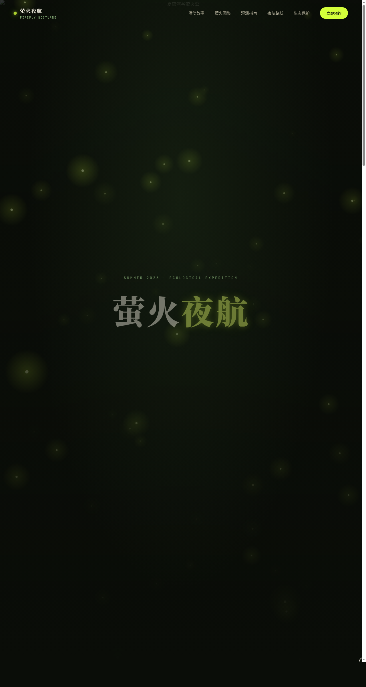

# 萤火夜航 Firefly Nocturne

> 日期：2026-08-17　方向：V1 网页设计

夏夜河谷萤火虫生态保护沉浸式活动官网——单页艺术品级可交互网站。围绕黄缘萤 / 条背萤 / 窗胸萤等真实萤火虫种类与生态保护知识组织内容，含活动故事、萤火图鉴、观测指南（装备/礼仪/拍摄/安全）、夜航路线时间线、生态保护数据、预约报名等完整板块。

## 截图

## 动效亮点

萤火虫粒子群 Canvas（闪烁呼吸 + 随机游走 + 鼠标反平方斥力躲避）、自定义光标（白粗环 + 萤火黄内点 + 多层发光）、3D 卡片倾斜（弹簧阻尼）、光泽扫过、滚动渐入、数字计数、Hero 视差、品牌脉冲，共 12+ 组件级特效。

## 妙搭在线预览

https://dcniaqwtmoca.feishu.cn/page/XVnzmaB9DdWXCsac1TtcIdrFn0b

## 文件说明

| 文件 | 说明 |
|------|------|
| index.html | 完整单页源码（JSX/CSS 全内联） |
| 设计规范.md | 色彩 / 字体 / 圆角 / 动效 / 页面结构规范 |
| preview.png | 页面截图 |
| README.md | 本说明 |

## 技术栈

HTML + 内联 CSS + Babel 内联 JSX（React）；Canvas 粒子系统；IntersectionObserver；统一 RAF 管理器 + visibilitychange 暂停；支持 prefers-reduced-motion。
