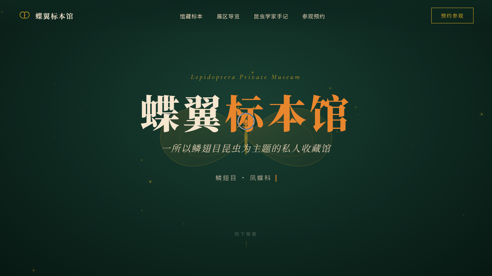

# 蝶翼标本馆 Lepidoptera

> 日期：2026-08-17 · 方向：V1 网页设计 · 主题：私人蝴蝶与蛾类标本博物馆单页网站

## 简介

一座收藏蝴蝶与蛾类标本的私人博物馆单页网站，围绕馆藏标本、展区导览、昆虫学家手记、参观预约组织真实可信内容。墨绿底色配蝶翼琥珀橙与标本金，营造标本盒般的静谧展陈氛围。

## 截图

## 动效亮点

- 自定义光标（白粗环 + 琥珀内点 + 多层发光），悬停放大变色、点击涟漪
- 蝶翼扇动 SVG（左右翼对称拍动）+ Hero 浮动金粉粒子（40 颗）
- 标本卡片 3D 倾斜（mousemove 直接操作 DOM transform + RAF 阻尼）+ 光泽扫过
- 打字机副标题、数字计数、滚动渐入、导航栏滚动收缩

## 文件说明

| 文件 | 说明 |
|------|------|
| index.html | 完整可运行源码（单文件，内联 CSS/JS） |
| 设计规范.md | 色彩系统、字体、组件、动效、页面结构 |
| preview.png / thumbnail.png | 页面截图 |

## 妙搭在线预览

https://dcniaqwtmoca.feishu.cn/page/KHHjmZ30Cdza8aa2o0EcO916nTd

## 技术栈

原生 HTML/CSS/JS，无框架依赖，IntersectionObserver + requestAnimationFrame 动效，支持 prefers-reduced-motion。
