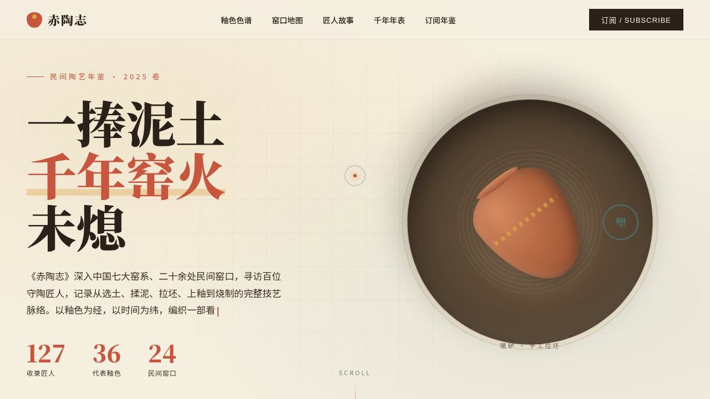

# 赤陶志·民间陶艺年鉴

> 日期：2026-08-17 · 方向：V1 网页设计 · 主题：民间陶艺在线年鉴/杂志站

## 简介

一份聚焦民间陶艺、窑口、匠人与釉色色谱的在线年鉴。以杂志式排版呈现陶轮拉坯封面、釉色色谱卡、窑口地图、匠人故事、千年窑火年表与订阅区块，内容围绕真实民间陶艺组织。

## 截图

## 动效亮点

- 自定义光标（白环 + 赤陶红内点 + 多层发光，开页居中，悬停放大变色，点击涟漪）
- 辘轳陶轮匀速旋转 + 陶坯随转
- 釉色卡 3D 倾斜（lerp 跟随）+ 光泽扫过
- 匠人卡 3D 翻转、时间线节点 hover 外发光
- 鼠标驱动 Hero 视差（陶轮与塑型手反向位移）
- 共 13 个组件级动效

## 妙搭在线预览

https://dcniaqwtmoca.feishu.cn/page/ThYsmPPeOdV7kGaGBFGcpaoBnMN

## 文件说明

| 文件 | 说明 |
|------|------|
| index.html | 完整可运行源码（内联 CSS + JS） |
| thumbnail.png | 页面截图 |
| 设计规范.md | 色彩/字体/组件/动效规范 |

## 技术栈

单文件 HTML，无外部框架依赖；移动端 768px 响应式。

## 配色

赤陶红 #C8553D · 赭黄 #D9A441 · 奶白 #F5EFE0 · 墨褐 #2B2118 · 釉青 #4A7C74
