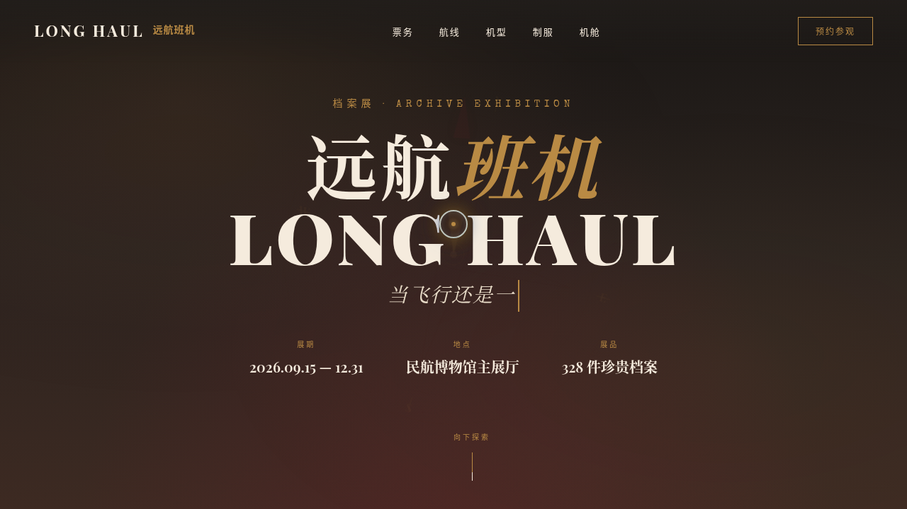

# 远航班机 LONG HAUL · 航空黄金时代档案展

> 日期：2026-08-17 · 方向：V1 网页设计 · 主题：民航黄金时代沉浸式档案展官网

## 简介

一件艺术品级单页网站，回到 1960-70 年代民航黄金时代：复古机票、环球航迹、经典机型档案、空中制服、机舱剖面与数据纵览，构成一座可滚动的空中档案馆。复古旅行海报气质（深酒红 + 奶油纸 + 铜金 + 炭墨）。

## 截图

## 动效亮点

自定义光标（弹簧阻尼+铜金内点+涟漪）、罗盘旋转+指针钟摆、打字机副标、金色粒子漂浮、机票 3D 倾斜翻面盖章、航线 dash 流动+城市脉冲、机型卡惯性倾斜、数字计数缓动、机舱顶灯呼吸。

## 妙搭在线预览

https://dcniaqwtmoca.feishu.cn/page/RHZ4mYHYLd9QnyaF9kYcsEQ2nUd

## 文件说明

| 文件 | 说明 |
|------|------|
| index.html | 完整可运行源码（JSX/CSS 全内联） |
| 设计规范.md | 色彩/字体/组件/动效/页面结构 |
| preview.png | 页面截图 |
| thumbnail.png | 平台缩略图 |
| README.md | 本说明 |

## 技术栈

React 18 + Babel standalone（全内联），自定义光标与 RAF 动效系统，支持 prefers-reduced-motion。
