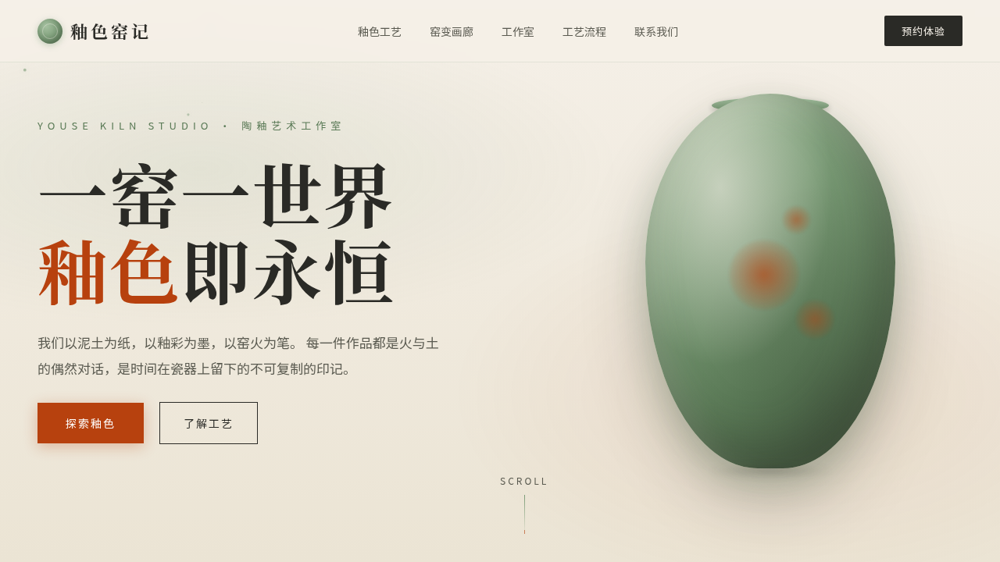

# 釉色窑记 · 陶釉艺术工作室

> 日期：2026-08-17 · 方向：V1 网页设计 · 主题：陶瓷釉色工艺与窑变艺术

## 简介

「釉色窑记」是一个陶釉艺术工作室的官方网站，以青瓷绿、铁锈红、骨白为主色调，展现四大经典釉色的工艺之美。网站包含 Hero 入场、釉色卡片展示、窑变画廊、工作室介绍、工艺流程时间线、品牌故事等 7 大板块，所有内容均可真实交互。

## 截图

## 配色

青瓷绿 `#7a9b76` + 铁锈红 `#b7410e` + 骨白 `#f5f0e8`

## 动效亮点

- 自定义光标（外环阻尼 + 内点 + 点击涟漪）
- Hero 釉色尘埃粒子漂浮
- 釉色卡片 3D 倾斜 + 光泽扫过 + 开片纹扩散
- 磁力按钮（反平方衰减吸附）
- 数字计数（指数缓出）
- 窑火亮度随滚动变化
- 时间线 SVG 路径绘制动画

## 文件说明

| 文件 | 说明 |
|------|------|
| `index.html` | 完整单文件源码（HTML/CSS/JS 全内联） |
| `设计规范.md` | 色彩系统、字体、组件、动效规范 |
| `thumbnail.png` | 页面预览截图 |
| `package.json` | 项目元数据 |

## 在线预览

[釉色窑记 · 妙搭在线预览](https://dcniaqwtmoca.feishu.cn/page/Ou5RmpXGQdslIqaQT6TcNUWgn2f)

## 技术栈

纯 HTML/CSS/JS 单文件，无 React/Babel 依赖。IntersectionObserver + requestAnimationFrame + visibilitychange + prefers-reduced-motion。
