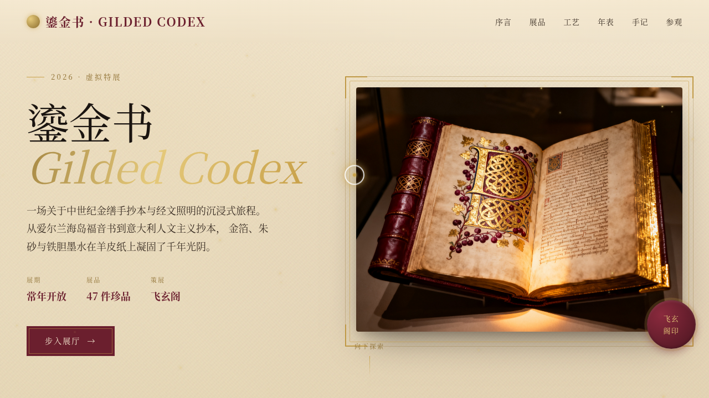

# 鎏金书 Gilded Codex · 金缮手抄本艺术展

- **日期**：2026-08-17
- **方向**：V1 网页设计
- **主题**：中世纪金缮手抄本与经文照明的虚拟艺术展官网

## 简介

「鎏金书」是一场关于金箔手抄本、泥金装饰字母、羊皮纸经文与金缮修复技艺的虚拟艺术展。围绕真实展品（圣哥伦巴福音书、贝里公爵时祷书、林迪斯法恩福音书、金缮本《启示录》等）组织内容，含金缮修复工艺、千年时间轴、修复师手记与参观信息。单页滚动，6 大区块。

## 设计说明

- **配色**：陈年酒红 `#6B1F2E` + 古金 `#C9A24B` + 羊皮纸 `#F4E8D0` + 墨色 `#1A1410`，温暖古典金箔质感，无蓝紫渐变。
- **字体**：Cormorant Garamond / Noto Serif SC 衬线体，呼应手抄本气质。
- **布局**：Hero 主视觉 + 序言 + 展品画廊（金框卡片）+ 金缮工艺 + 时间轴 + 修复师手记 + 参观信息，阴影 / 金边 / 色块分层。

## 动效亮点

13 个组件级特效：自定义光标（白环+金点+发光+涟漪）、金粉粒子飘落、滚动渐入、卡片金框发光、Hero 3D 倾斜视差、数字计数、金箔标题扫光、打字机序言、按钮涟漪、羊皮纸视差、印章脉冲、入场序列、导航滚动渐变。

## 截图

## 妙搭在线预览

https://dcniaqwtmoca.feishu.cn/page/Hs01m84pAdfjfmaMi1Lc7phanXe

## 文件说明

| 文件 | 说明 |
|------|------|
| index.html | 完整可运行源码（纯 vanilla 单文件） |
| 设计规范.md | 色彩系统 / 字体 / 组件 / 动效 / 页面结构 |
| thumbnail.png | 页面截图 |
| README.md | 本说明 |

## 技术栈

纯 vanilla HTML/CSS/JS 单文件，无 React / Babel / 外部 CDN 依赖，所有代码内联。
