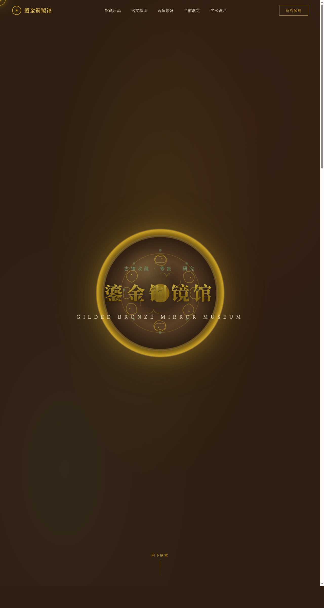

# 鎏金铜镜馆 · 古镜博物馆

> 日期：2026-08-17 · 方向：V1 网页设计 · 主题：中国古代铜镜博物馆官网

## 简介

一座专门收藏、研究、修复中国古代铜镜的虚拟博物馆官网。围绕铜镜组织真实可信内容：馆藏珍品（汉海兽葡萄镜、唐瑞兽鸾鸟镜、战国四山镜、宋人物故事镜等）、镜背纹饰拓片、铭文释读、铸造与修复工艺、展讯与学术研究。所有铜镜纹饰均用纯 SVG 绘制，无外部图片依赖。

## 配色

古铜深褐 `#2E1F12` + 铜绿锈 `#6B8E6B` + 鎏金 `#C9A227`/`#E0B83A` + 朱砂红 `#A83232` + 米白宣纸 `#F2EAD6`。青铜文物质感，鎏金高光，朱砂印章点缀。禁止蓝紫渐变。

## 动效亮点

- 自定义光标：铜镜圆环 + 鎏金内点 + 多层发光，开页即现于屏幕中央，悬停放大变色，点击涟漪
- Hero 铜镜 3D 鼠标倾斜（惯性阻尼 + 镜面高光漂移）
- 铜绿浮尘粒子系统、纹饰 SVG 描边动画
- 铭文打字机（5 篇可切换）、馆藏数字计数
- 悬停鎏金光泽扫过、滚动渐入、朱砂印章脉冲

共 12+ 组件级特效，基于 RAF 积分器 / 阻尼 / 惯性，周期各不相同。

## 截图

## 妙搭在线预览

https://dcniaqwtmoca.feishu.cn/page/ZZuImJ7JpdgQWTaWW4ucEVqpnud

## 文件说明

| 文件 | 说明 |
|---|---|
| index.html | 单文件完整源码（内联 CSS + JS，纯 vanilla，无外部 CDN 依赖） |
| preview.png | 1280×2400 页面截图 |
| 设计规范.md | 色彩系统 / 字体 / 组件 / 动效 / 页面结构规范 |
| README.md | 本说明文件 |

## 技术栈

纯 HTML / CSS / JavaScript（vanilla），SVG 绘制铜镜纹饰，无 React / 无 Babel / 无外部 CDN。
