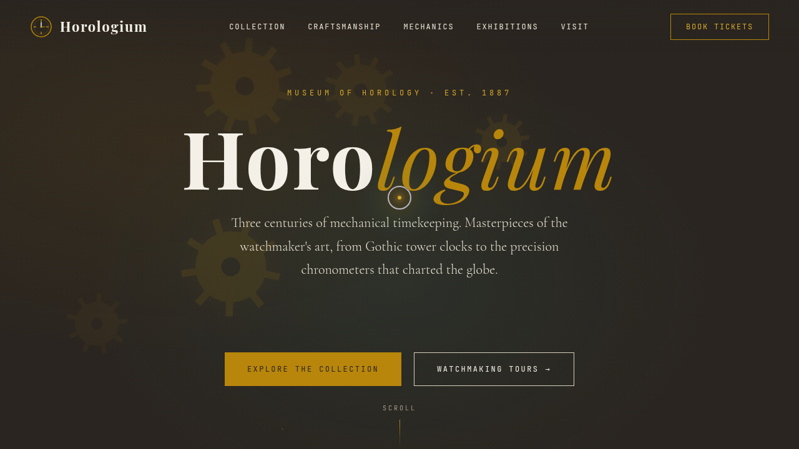

# 钟表齿轮博物馆 Horologium · 网页设计

> 日期：2026-08-17 · 方向：V1 网页设计 · 主题：机械钟表与制表工艺博物馆

## 简介

一座虚拟的机械钟表博物馆官网，以黄铜金与铜锈绿为主色调，穿越文艺复兴到现代的钟表藏品世界。页面含 8 个区块：Hero 主视觉、时代收藏馆（4 时期 Tab）、制表六大工艺、齿轮传动原理演示、擒纵机构与钟摆、展览活动、参观信息、Newsletter。纯 vanilla 单文件实现，16+ 组件级动效围绕钟表机械原理展开——齿轮咬合旋转、钟摆物理振荡、表盘实时指针、打字机铭文轮播。

## 截图

## 动效亮点

- **齿轮咬合旋转**：5 级齿轮以不同传动比持续旋转，模拟真实机械传动
- **钟摆物理振荡**：2.5s 周期钟摆 + 擒纵轮联动
- **自定义光标**：白色粗环 + 黄铜内点 + 多层发光，悬停变形点击涟漪
- **打字机轮播**：拉丁铭文逐字打出循环
- **滚动渐入**：IntersectionObserver + 错位延迟入场
- **3D 卡片倾斜**：鼠标跟随 tilt，直接操作 DOM 不触发重渲染

## 文件说明

| 文件 | 说明 |
|------|------|
| `index.html` | 完整单页网站源码（含 HTML/CSS/JS） |
| `preview.png` | 页面截图 |
| `设计规范.md` | 设计规范文档（色彩/字体/动效/页面结构） |

## 妙搭在线预览

https://dcniaqwtmoca.feishu.cn/page/FnNkm0jA5d397Fa2qVscJwj5ntf

## 技术栈

纯 vanilla HTML/CSS/JS 单文件，零外部依赖。支持 prefers-reduced-motion、visibilitychange 自动暂停动画。
