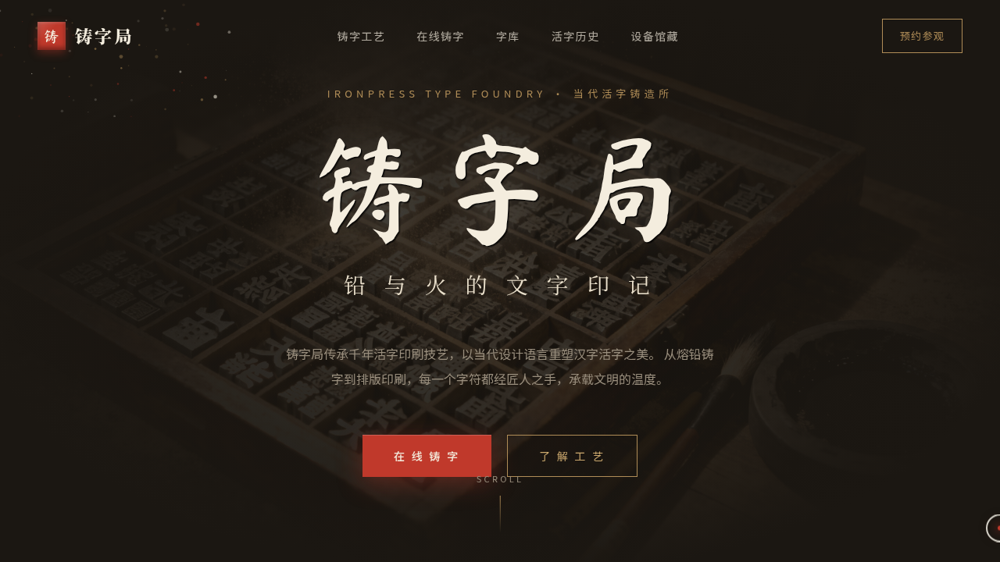

# 铸字局 IronPress · 活字印刷品牌官网

> 日期：2026-08-17 ｜ 方向：V1 网页设计 ｜ 主题：当代活字铸造所品牌官网

## 简介

「铸字局 IronPress」是一间当代活字铸造所的品牌官网。围绕真实可信的活字印刷文化组织内容：铅字铸造六道工序、汉字活字历史脉络（毕昇泥活字 / 王祯木活字 / 明铜活字 / 清聚珍版）、字库馆藏、铸字设备藏品，并提供可输入文字的「在线铸字机」与可点击置字的「拣字盘」交互装置。

## 截图

## 动效亮点

- 自定义光标：白环 + 朱砂内点 + 多层发光，弹簧阻尼跟随，点击涟漪。
- 粒子粉尘系统：反平方引力 + 正弦漂移 + 呼吸闪烁，模拟铸字工坊浮尘。
- 在线铸字机：输入文字实时渲染为铅字凸版效果，可调字重 / 字号 / 油墨浓度。
- 字库 72 字网格逐字悬停浮雕凸起。
- 拣字盘：点击空格置入铅字、点击取出，铅字弹性浮动入场。
- 滚动驱动的时间线叙事与光泽扫过按钮。

## 文件说明

| 文件 | 说明 |
|---|---|
| `index.html` | 完整可运行源码（内联 CSS + 内联 Babel JSX） |
| `preview.png` | 页面截图 |
| `thumbnail.png` | 缩略图 |
| `设计规范.md` | 色彩 / 字体 / 组件 / 动效 / 页面结构规范 |

## 在线预览

[铸字局 IronPress 妙搭应用](https://dcniaqwtmoca.feishu.cn/page/XjQcmbPWqdlZDraHRdaclYegnrd)

## 技术栈

React + Babel standalone（内联 `<script type="text/babel">`），单文件 HTML，无外部 JSX/CSS 文件。
