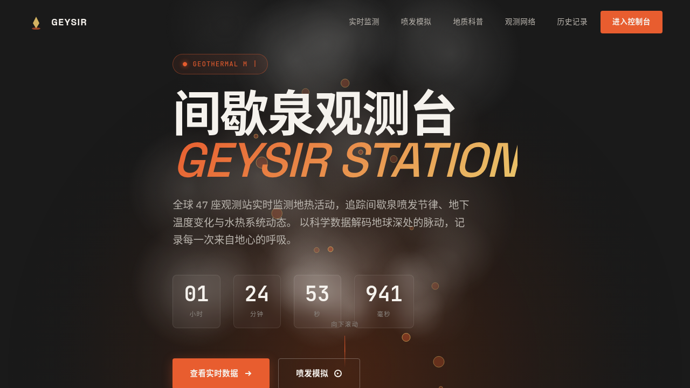

# 间歇泉观测台 Geysir Station

> 日期：2026-08-17 · 方向：V1 网页设计 · 主题：地热间歇泉监测观测台官网

## 简介

间歇泉观测台（Geysir Station）是一个地热间歇泉监测观测台的官方网站，展示全球间歇泉的实时喷发数据、地质活动可视化、观测站网络与科普知识。蒸汽白 + 地热橙 + 矿物青 + 玄武岩黑的配色体系，配合蒸汽粒子升腾、Canvas 喷发模拟、地图脉冲标记等动效，营造地热观测站的沉浸式体验。

## 截图

## 动效亮点

自定义光标（白环+地热橙内点+光晕）、蒸汽粒子升腾、气泡上升摆动、打字机效果、喷发倒计时、滚动渐入、数字计数、3D卡片倾斜、Canvas 四阶段喷发模拟（加热→压力→喷发→消散）、频谱柱状图、地图脉冲标记、光泽扫过、导航栏收缩、状态脉冲点（14+ 动效）。

## 妙搭在线预览

https://dcniaqwtmoca.feishu.cn/page/FlxLmQAqcd3sdoaoOhUciq4hnrf

## 文件说明

| 文件 | 说明 |
|------|------|
| index.html | 完整可运行源代码（纯 vanilla HTML/CSS/JS 单文件） |
| 设计规范.md | 色彩系统、字体、组件、动效、页面结构设计规范 |
| preview.png | 页面截图 |
| thumbnail.png | 平台自动生成缩略图 |

## 技术栈

纯 vanilla HTML/CSS/JS · Canvas 2D API · SVG + SMIL · IntersectionObserver · requestAnimationFrame · 支持 prefers-reduced-motion
