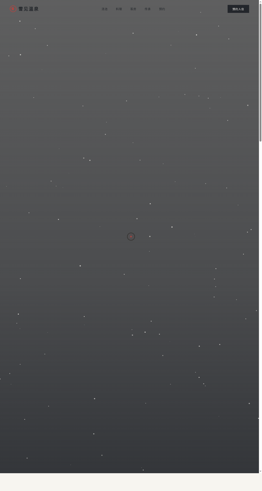

# 雪见温泉 Yukimi Onsen

> 日期：2026-08-17 ｜ 方向：V1 网页设计 ｜ 主题：越后雪国百年温泉旅馆官网

## 简介

「雪见温泉」是一家虚构的越后雪国百年温泉旅馆官网。以雪白与炭墨为底、朱红为品牌锚点，呈现汤池、四季会席、九间客房与预约入口。全页真实可交互，配 15+ 基于物理/语义的组件级动效。

## 动效亮点

- 雪花粒子系统：正弦摆动 + 重力 + 鼠标反平方斥力
- 蒸汽粒子（汤气语义）、3D 倾斜料理卡、磁性 CTA 按钮
- 自定义光标：弹簧阻尼跟随、朱红内点、悬停三态、点击涟漪
- 数字计数、打字机、滚动视差、光泽扫过、客房滑入填充

## 妙搭在线预览

https://dcniaqwtmoca.feishu.cn/page/S4R2mWimtduKwxay3RmchdWCnnb

## 文件说明

| 文件 | 说明 |
|------|------|
| index.html | 完整可运行源码（单文件，HTML+CSS+JS 内联） |
| 设计规范.md | 色彩/字体/组件/动效规范 |
| preview.png | 页面截图 |

## 技术栈

纯原生 HTML/CSS/JS 单文件，无框架无外部 JS 依赖。
