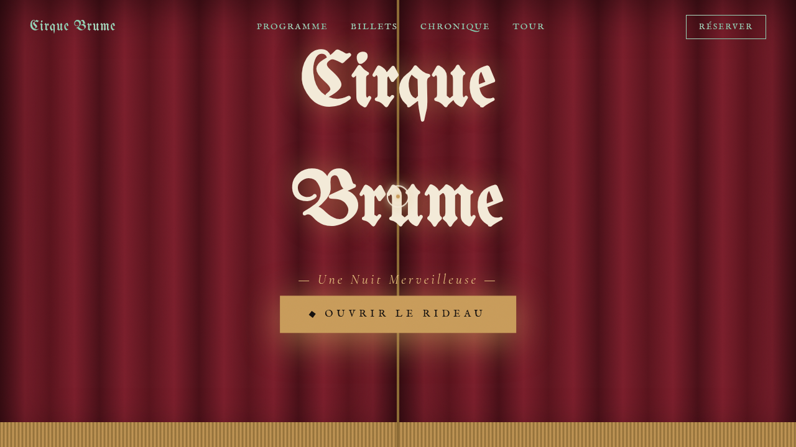

# 雾夜马戏团 Cirque Brume

- **日期**：2026-08-17
- **方向**：V1 网页设计
- **主题**：一支巡回奇幻马戏团的官方网站——雾气、丝绒幕布、聚光灯、空中飞人与火舞，神秘华丽的夜间马戏氛围。
- **配色**：深绯红 `#7A1E2B` + 炭黑 `#14100E` + 象牙白 `#F3EAD8` + 旧金黄铜 `#C89B5A`

## 简介
一件艺术品级单页网站 mock。点击「Ouvrir le Rideau」拉开深红丝绒幕布入场，包含节目单（6 个节目，可展开详情模态框）、帐篷环形选座购票（8 排座位 / VIP 与普通区 / 5 个日期 / 实时计价）、剧团编年史时间线（1887–1926）、8 个巡演城市与页脚。所有交互均可真实操作。

## 截图

## 动效亮点
自定义光标（白粗环+旧金内点+多层发光，开页即居中，悬停三态，点击涟漪弹簧）、幕布分轨开启、聚光灯摆动、尘埃粒子 Canvas、卡片 3D 倾斜弹簧阻尼、滚动渐入、打字机、数字计数、光泽扫过按钮、选座弹跳、时间线节点发光脉冲、跑马灯、视差聚光灯。

## 在线预览
- 妙搭应用：https://dcniaqwtmoca.feishu.cn/page/BAHLm1h7IdKSxvajxGOceFH1nxf

## 文件说明
| 文件 | 说明 |
|------|------|
| index.html | 完整可运行源码（JSX/CSS 全内联单文件） |
| 设计规范.md | 色彩系统、字体、组件、动效、页面结构 |
| thumbnail.png | 页面截图 |

## 技术栈
React 18 + Babel standalone（全内联）、Canvas 2D、CSS3 动画、自定义光标系统、prefers-reduced-motion 降级。
