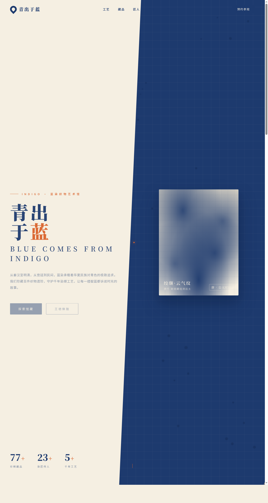

# 青出于蓝 · 蓝染织物艺术馆

- 日期：2026-08-17
- 方向：V1 网页设计
- 主题：传统蓝染（indigo dyeing）织物艺术品牌沉浸式官网

## 简介

围绕绞缬 / 蜡缬 / 夹缬 / 型染四大染缬工艺，呈现织物典藏、守蓝匠人、染缸色阶与工坊体验预约的完整官网。配色取靛蓝染液 + 素棉米白 + 柿橙点缀，纯色无蓝紫渐变。

## 截图

## 动效亮点

- 自定义光标：居中白环 + 橙内点 + 多层光晕，悬停三态、点击涟漪
- 染液粒子正弦漂移、染缸涟漪不规则扩散、织物 3D 倾斜（磁力弹簧）
- 数字计数 easeOutCubic、滚动渐入错位延迟、光泽斜向扫过

## 在线预览

https://dcniaqwtmoca.feishu.cn/page/AJvBmKMwfdc6N1a1To5csELhnyh

## 文件说明

| 文件 | 说明 |
|---|---|
| index.html | 完整可运行单页源码 |
| preview.png | 页面截图 |
| thumbnail.png | 平台缩略图 |
| 设计规范.md | 色彩 / 字体 / 组件 / 动效规范 |

## 技术栈

纯 HTML / CSS / 原生 JS（无框架、无外部 JSX 依赖），字体走 Noto Serif/Sans SC。
