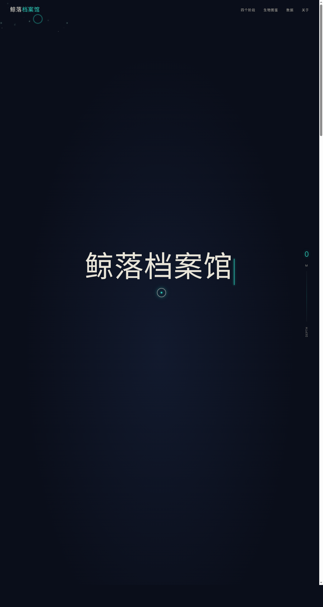

# 鲸落档案馆 — Whale Fall Archive

> 日期：2026-08-17 · 方向：V1 网页设计 · 主题：鲸落深海生态系统交互叙事

## 简介

「鲸落档案馆」是一个关于鲸落（whale fall）的交互式叙事网站。鲸落是鲸鱼死亡后沉入海底形成的深海绿洲生态系统，可持续数十年滋养上百种生物。网站以滚动叙事方式呈现鲸落的四个阶段——移动清道夫期、机会主义者期、化能合成期、礁体期，配合深海声呐视觉、生物图鉴、深度标尺等元素。

## 截图

## 动效亮点

- 深海粒子浮力模型上浮（不同大小/速度/透明度）
- 滚动驱动深度标尺（0m→4000m 实时变化）
- 声呐脉冲同心圆阻尼衰减扩散
- 生物图鉴卡片 hover 3D 倾斜（mousemove 直接操作 DOM）
- 数字计数缓动 + 三层环形生物多样性进度图
- 自定义光标：白环+荧光青内点+多层发光，开页即居中显示

## 配色

深海黑 `#0a0e1a` + 骨白 `#e8e4d8` + 荧光青 `#2dd4bf` + 腐败琥珀 `#d4a574` + 血锈红 `#8b3a3a`

## 文件说明

| 文件 | 说明 |
|------|------|
| `index.html` | 完整可运行源码（HTML+CSS+JS 内联单文件） |
| `preview.png` | 页面截图（1280×2400） |
| `设计规范.md` | 设计规范文档 |

## 妙搭在线预览

https://dcniaqwtmoca.feishu.cn/page/R8vSmM0aEdskniakEuJcuraEn1b

## 技术栈

HTML5 + CSS3 + Vanilla JS + Google Fonts（Cormorant Garamond / Inter），纯单文件无框架依赖
