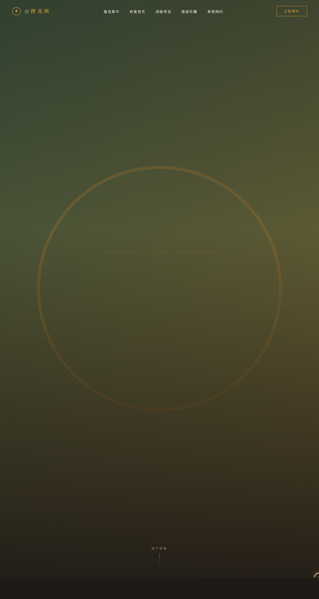

# 丝路花雨 · 敦煌壁画数字特展

- 日期：2026-08-18
- 方向：V1 网页设计
- 主题：敦煌壁画数字特展官方网站——飞天、藻井、经变画、供养人、壁画修复与参观预约

## 设计说明

以敦煌矿物颜料为色彩原点：石绿为主、赭石为强调、沙金作高光，墨黑与米白构成深浅分区。单页长滚动叙事：从沉浸式 Hero 落入数字统计，再入四大展览章节；「壁画修复」单元用拖动滑块对比修复前后；洞窟时间线、横向珍品画廊、题记打字机与预约表单收束全站。

## 动效亮点

- 自定义光标开页居中：白色粗环+沙金内点+多层发光，弹簧追帧，悬停变形、点击涟漪
- 沙尘粒子 + 飞天飘带 SVG 描边 + Hero 视差，营造窟内沙尘与飘带语义
- 壁画卡片 3D 倾斜、光泽扫过、悬停发光
- 数字计数（洞窟数/壁画面积）、题记打字机、时间线节点脉冲
- 修复前后对比滑块（clip-path+金色分隔线发光）、横向画廊拖拽惯性
- 共 15 个组件级特效，周期各异，支持 prefers-reduced-motion 降级

## 文件说明

| 文件 | 说明 |
|---|---|
| index.html | 完整源码（样式与脚本全部内联，可直接在浏览器打开预览） |
| 设计规范.md | 色彩/字体/结构/动效/健壮性设计令牌 |
| preview.png | 本地渲染长截图（1280×2400） |
| thumbnail.png | 平台生成缩略图 |

## 在线预览

妙搭应用：https://dcniaqwtmoca.feishu.cn/page/WbcimzRBBdIPUNaxqsYcYBq6nvd

## 技术栈

单文件 HTML + 内联 CSS/JS（无外部框架依赖），IntersectionObserver / RAF 物理积分 / SVG 描边动画 / clip-path。
