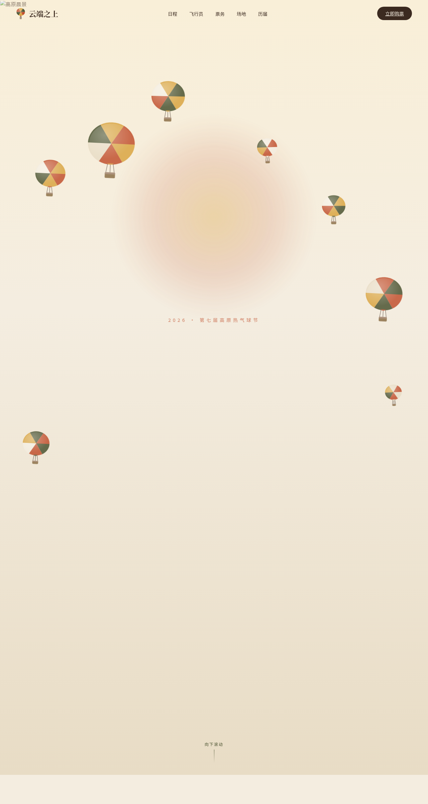

# 云端之上 Skybound · 高原热气球节官网

- **日期**：2026-08-18
- **方向**：V1 网页设计
- **主题**：高原热气球节「云端之上 Skybound」官方网站——单页艺术品级节庆官网

## 简介

一座高原盆地里的热气球节官网。晨光、峡谷草甸、拼布色块的热气球为视觉主角。8 大区块单页滚动：Hero 主视觉、数字统计、三天日程时间轴、飞行员阵容、票务三档、场地指南 SVG 热点、历届瞬间视差画廊、页脚订阅。大地色系（陶土红 + 沙金 + 石灰白 + 墨橄榄 + 深栗棕），禁止蓝紫渐变。

## 截图

## 动效亮点

- 自定义光标：开页即居中显示，白环 + 陶土红内点 + 多层发光，弹簧阻尼跟随，悬停放大、点击涟漪
- 热气球浮空物理：8 只气球正弦+阻尼漂浮，周期各异
- 3D 卡片倾斜（直接操作 DOM transform，不触发重渲染）
- 数字计数、画廊滚动视差、时间轴进度线、SVG 热点脉冲、按钮磁性吸附、打字机标语

## 在线预览

[云端之上 · 妙搭在线预览](https://dcniaqwtmoca.feishu.cn/page/TOqamoqnUd2K2eabcy9cOEEGn0e)

## 文件说明

| 文件 | 说明 |
|---|---|
| index.html | 完整可运行源码（HTML/CSS/JS 内联单文件） |
| 设计规范.md | 色彩 / 字体 / 组件 / 动效 / 页面结构规范 |
| preview.png | 页面截图 |
| README.md | 本说明文件 |

## 技术栈

纯 HTML/CSS/vanilla JS 单文件，无框架依赖。
