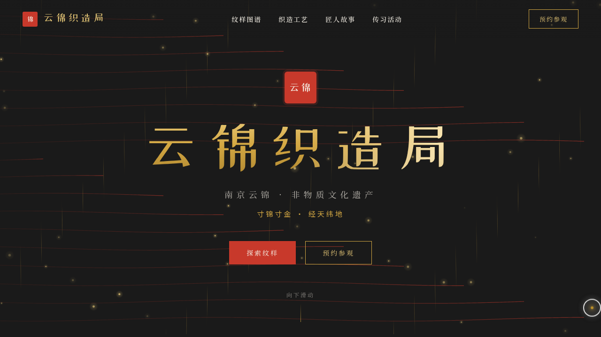

# 云锦织造局 · V1 网页设计

**日期**：2026-08-18
**方向**：V1 网页设计
**主题**：云锦织造局 — 南京云锦传统织造工艺品牌官网

## 简介

以"寸锦寸金"为核心理念的云锦织造工艺品牌官网。页面围绕云锦的纹样图谱、织造工艺、匠人故事与传习活动展开，配色采用朱砂红+鎏金+墨绿+宣纸白的传统中式色调，整体呈现典雅华丽的工艺品牌质感。

## 截图展示

## 动效亮点

- Hero 区 Canvas 织机经纬线动画（经丝波动+纬丝穿梭流动+金色粒子飘散）
- 纹样图谱悬停光泽扫过 + 放大展开
- 匠人卡片 3D 倾斜悬停 + 头像脉冲涟漪
- 滚动驱动的数字计数 + 元素渐入
- 自定义光标（白色粗环+鎏金内点+多层发光）

## 文件说明

| 文件 | 说明 |
|------|------|
| index.html | 完整源码（HTML/CSS/JS 单文件内联） |
| 设计规范.md | 色彩系统、字体、组件、动效、页面结构规范 |
| preview.png | 页面截图 |

## 妙搭在线预览

https://dcniaqwtmoca.feishu.cn/page/FZdhmywpwdyT9ma0sHCc24DUnSP

## 技术栈

纯 vanilla HTML/CSS/JS 单文件，Canvas 2D 织机动画，SVG 纹样绘制，IntersectionObserver 滚动驱动。
