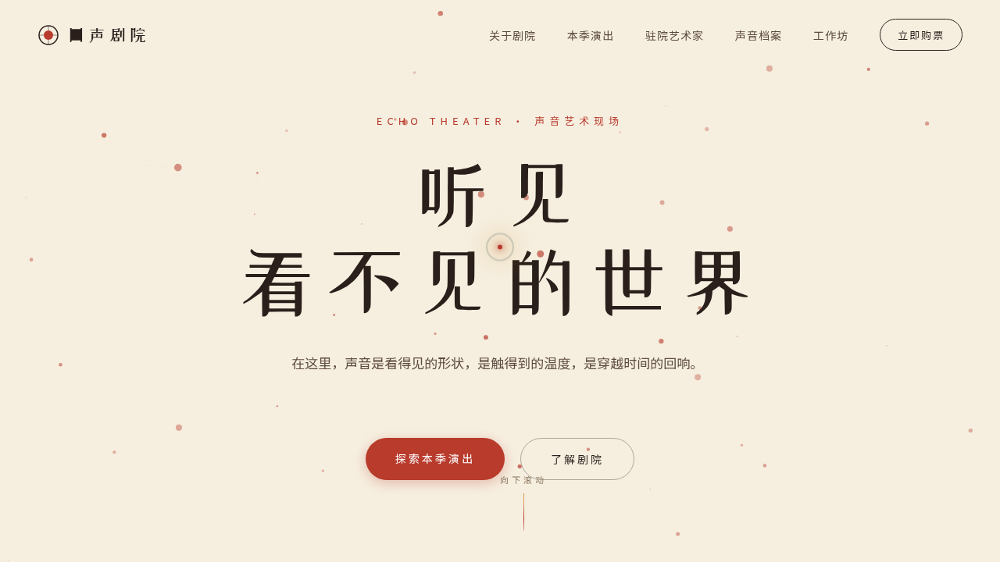

# 回声剧院 · V1 网页设计

**方向：** V1 网页设计
**日期：** 2026-08-18
**主题：** 回声剧院 — 一座为声音艺术建造的沉浸式数字剧院官网

## 简介

以"声音、剧场、田野"为核心叙事的单页网站，呈现本季演出、驻院艺术家、田野录音档案与公教工作坊。米奶油纸底 + 朱砂红 + 赭石金 + 苔绿 + 深棕的东方剧场质感，避开蓝紫渐变与常见模板色板。

## 截图

## 动效亮点

- Hero 粒子声场：Canvas 粒子 + 鼠标反平方引力 + 声波呼吸
- 打字机副标题、3D 卡片倾斜（弹簧阻尼）、视差滚动、频谱振动、头像脉冲
- 自定义光标开页即居中，悬停 / 点击三态变化

## 文件说明

| 文件 | 说明 |
|------|------|
| index.html | 完整可运行源码（含内联 CSS / JSX） |
| preview.png | 页面截图 |
| thumbnail.png | 妙搭平台缩略图 |
| 设计规范.md | 色彩 / 字体 / 组件 / 动效规范 |

## 妙搭在线预览

https://dcniaqwtmoca.feishu.cn/page/FQw0mO5JBdr0MXapQprcvfuXn4c

## 技术栈

React 18 + Babel standalone（全部内联）+ Canvas 2D + IntersectionObserver + RAF
