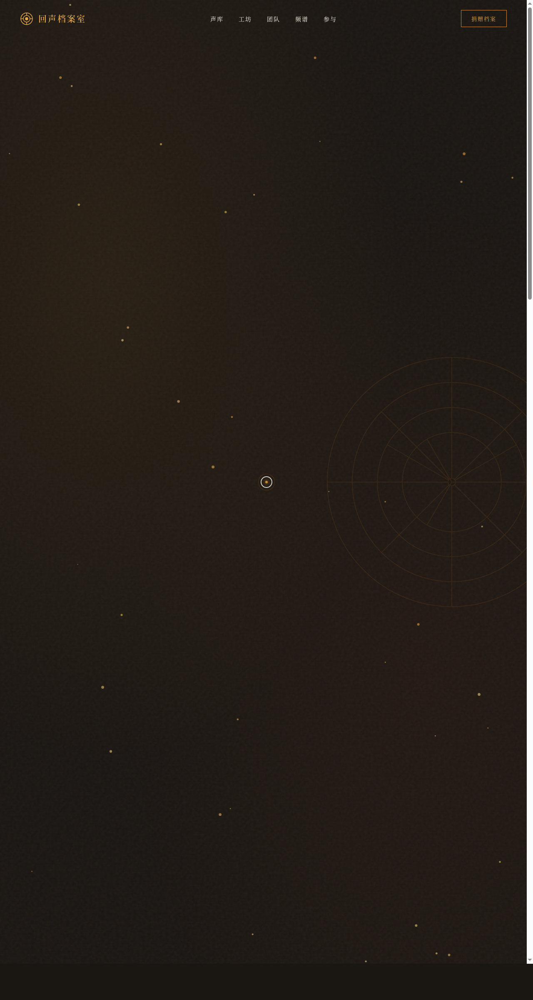

# 回声档案室 · V1 网页设计

**日期**：2026-08-18
**方向**：V1 网页设计
**主题**：回声档案室 —— 非营利声音档案机构官网，记录正在消逝的声音

## 简介
一家虚构的非营利声音档案机构的完整单页官网。围绕「保存消逝的声音」这一主题，展示六种濒危声音档案（胡同鸽哨、侗寨大歌、寒山钟声、戈壁驼铃、老街叫卖、冰川裂鸣），配以磁带卷轴视觉、频谱交互可视化、档案卡片流等内容。

## 设计说明
- 配色：墨黑+琥珀金+赭石暖调的档案文献质感，无蓝紫渐变
- 字体：宋体衬线+等宽数据字体，模拟档案卷宗阅读体验
- 视觉风格：暗色档案室氛围，暖金光晕，磁带/黑胶/旋钮等声音载体元素

## 动效亮点
- 自定义光标（白色粗环+琥珀内点+脉冲外圈，三态切换）
- 40 颗暖金粒子漂浮（浮力+摆动+鼠标反平方斥力）
- 64 条频谱柱弹簧物理可视化（5 种声音预设切换）
- 卡片 3D 倾斜+光泽扫过+惯性阻尼
- 磁带卷轴四层正反转交错

## 截图

## 妙搭在线预览
https://dcniaqwtmoca.feishu.cn/page/CXEvmcNcldJFxHaBs2McmrcgnwX

## 文件说明
| 文件 | 说明 |
|------|------|
| index.html | 完整源码（纯 vanilla HTML/CSS/JS 单文件） |
| preview.png | 页面截图 |
| 设计规范.md | 色彩系统、字体、组件、动效规范 |
| thumbnail.png | 缩略图 |

## 技术栈
纯 vanilla HTML/CSS/JS 单文件，零外部依赖，无 React/Babel/CDN
