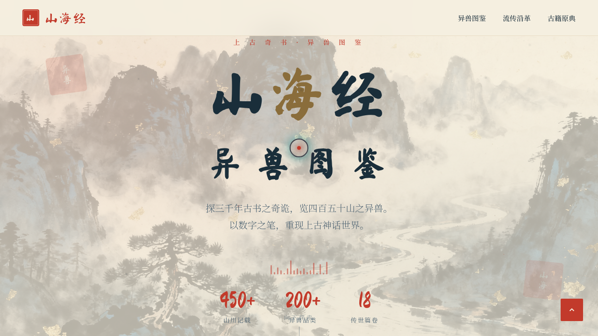

# 山海经异兽图鉴 · V1 网页设计

**日期**：2026-08-18
**方向**：网页设计（V1）
**主题**：山海经异兽图鉴

## 简介
以《山海经》上古奇书为灵感的数字异兽图鉴网站。宣纸米白底 + 朱砂红 + 黛青 + 金箔的东方古籍美学，收录九尾狐、凤凰、麒麟、应龙、烛龙、白泽、精卫、毕方八只经典异兽，配以卷轴式详情、流传沿革时间轴与古籍原典引用。

## 截图

## 动效亮点
自定义光标（弹簧跟随+悬停三态）、墨点粒子、Hero 视差、卡片 3D 倾斜（弹簧积分）、数字计数、频谱条、朱砂印脉冲、光泽扫过、打字机、滚动渐入、模态弹簧弹出等 16 项组件级特效。

## 妙搭在线预览
https://dcniaqwtmoca.feishu.cn/page/NACdmpoILdWyx5akxZicLfjGnMe

## 文件说明
| 文件 | 说明 |
|---|---|
| index.html | 完整可运行源码（单文件，含内联 CSS/JS） |
| 设计规范.md | 色彩系统、字体、页面结构、动效系统 |
| preview.png | 页面截图 |
| thumbnail.png | 缩略图 |

## 技术栈
纯 HTML/CSS/JS 单文件，无外部框架依赖，IntersectionObserver + requestAnimationFrame 物理动效。
