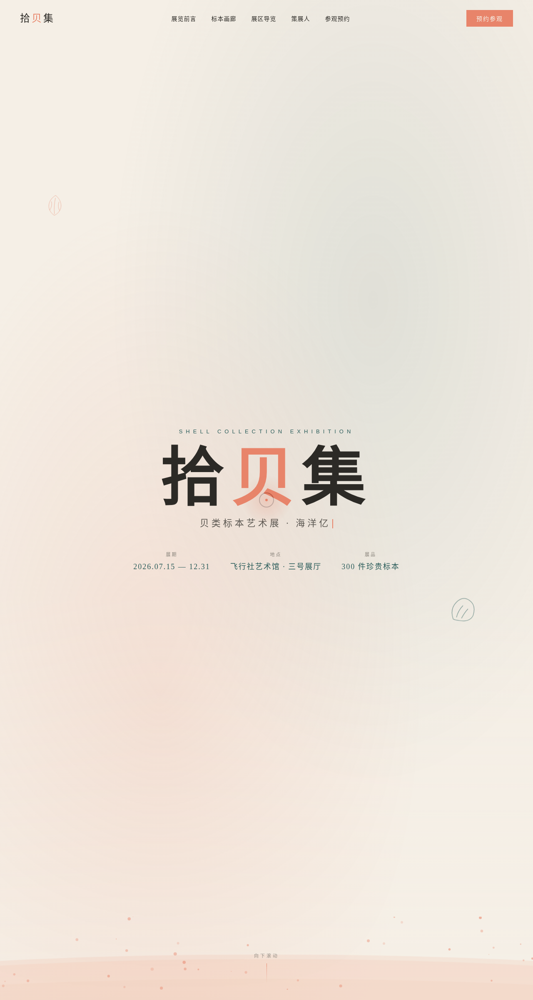

# 拾贝集 · 贝类标本艺术展

> 方向：V1 网页设计　日期：2026-08-18

一场贝类与海洋标本艺术展览的完整单页官网。围绕「海洋亿万年的沉默诗行」主题，组织展览前言、标本画廊、展区导览、策展人、参观预约等真实内容，配色取珊瑚橘 + 深海青绿 + 米白，契合文艺极简的展览气质。

## 截图

## 动效亮点

- 自定义光标（弹簧物理跟随 + 悬停三态 + 点击涟漪），开页即显示
- 标本卡片 3D 倾斜（RAF 阻尼积分器）+ 贝壳光泽斜向扫过
- 潮汐波浪（三层错相正弦波）+ 首屏鼠标视差
- 滚动数字计数、打字机副标题、滚动渐入
- 磁性按钮（反平方引力）+ 预约按钮脉冲环
- Canvas 滚动粒子（正弦波驱动）

共 14 项组件级特效，动效周期各不相同，符合主题语义。

## 妙搭在线预览

https://dcniaqwtmoca.feishu.cn/page/LYQmmC2G1dcL2uaksvEcP9h5nLe

## 文件说明

| 文件 | 说明 |
| --- | --- |
| index.html | 完整可运行源码（React 18 + Babel，JSX/CSS 全内联） |
| preview.png | 页面截图（1280×2400） |
| 设计规范.md | 色彩/字体/组件/动效/页面结构规范 |

## 技术栈

React 18 + Babel standalone，单文件 HTML，无构建步骤。支持 prefers-reduced-motion 降级；RAF/定时器随页面可见性暂停、卸载取消。
