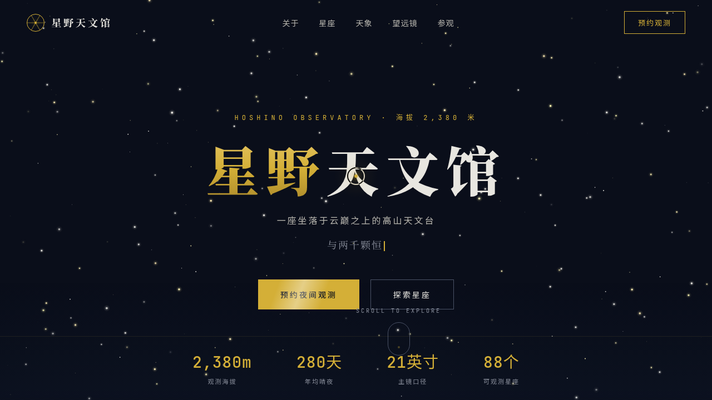

# 星野天文馆 · 网页设计 Mock

> 日期：2026-08-18 · 方向：V1 网页设计 · 主题：高山天文台官方网站

## 简介

「星野天文馆」是一座高山天文台的官方网站设计 mock，单页 7 大区块：首屏星野 Hero、关于天文台、当季星座（6 张含 SVG 星图连线）、天象日历（5 个月可切换）、望远镜设备（4 台可切、参数实时更新）、参观预约表单、页脚。围绕星空观测主题组织真实可信内容，配色为深空蓝黑夜空底 + 星金 + 雾白 + 暗银灰，禁用蓝紫渐变。

## 动效亮点

- 全屏星野粒子系统（正弦+谐波大气闪烁模型）与流星（重力弧线）
- 自定义三层光标（白环+金点+辉光，阻尼惯性跟随），悬停可交互元素放大+十字准星+涟漪
- 圆顶卡片 3D 倾斜（RAF 阻尼积分器）、星座卡片 SVG 连线描边、望远镜鼠标驱动旋转
- 磁性按钮（反平方引力）、光泽扫过、打字机轮播、统计数字弹性计数、滚动渐入

## 文件说明

| 文件 | 说明 |
|------|------|
| index.html | 完整可运行源码（纯 vanilla 单文件，零外部依赖） |
| 设计规范.md | 色彩/字体/组件/动效/页面结构规范 |
| thumbnail.png | 页面截图 |

## 技术栈

纯 HTML/CSS/JS 单文件，无 React / 无 Babel / 无外部 CDN 依赖。支持 `prefers-reduced-motion` 降级，动画循环随 `visibilitychange` 暂停。

## 在线预览

[星野天文馆 · 妙搭在线预览](https://dcniaqwtmoca.feishu.cn/page/Ja9amd0gfdOQW7aBlFpcP5Klnjd)
