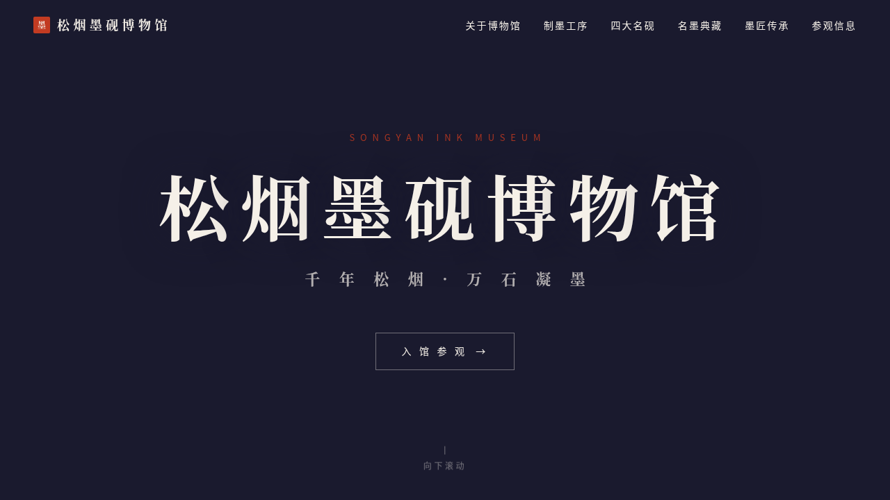

# 松烟墨砚博物馆 · V1 网页设计

**日期**：2026-08-18  
**方向**：网页设计  
**主题**：松烟墨砚博物馆 — 中国传统制墨工艺与砚台文化沉浸式博物馆官网

## 简介

「松烟墨砚博物馆」是一个以中国传统制墨工艺与砚台文化为主题的沉浸式单页网站。围绕松烟墨、油烟墨、朱砂墨的制墨六序（炼烟、和料、捣磨、压模、晾干、描金）和四大名砚（端砚、歙砚、洮砚、澄泥砚），结合历代墨匠（李廷珪、潘谷、程君房、曹素功）的故事，构建一个墨韵十足的滚动叙事网站。

## 截图

## 设计亮点

- **水墨粒子背景**：首屏 Canvas 墨滴扩散粒子动画，鼠标交互
- **朱砂印章**：点击入馆按钮触发印章盖落动画
- **名砚3D倾斜**：鼠标跟随的卡片 3D 倾斜效果
- **工序时间轴**：6 道制墨工序依次亮起的序列动画
- **墨迹连线**：SVG 路径绘制动画连接工序节点

## 动效亮点

12 个组件级特效：自定义光标、水墨粒子背景、滚动渐入、3D倾斜、工序序列、墨迹连线、视差滚动、卡片发光、数字计数、朱砂印章、毛笔加载条、墨滴返回按钮。

## 文件说明

| 文件 | 说明 |
|------|------|
| index.html | 完整可运行源代码（纯 vanilla HTML/CSS/JS 单文件） |
| 设计规范.md | 色彩系统、字体、组件规范、动效系统、页面结构 |
| thumbnail.png | 页面预览截图 |

## 妙搭在线预览

https://dcniaqwtmoca.feishu.cn/page/KyTVma1UKdTN0oauGipcNRNgnPe

## 技术栈

- 纯 vanilla HTML / CSS / JavaScript（无 React / 无 Babel / 无外部 CDN 依赖）
- Canvas API（粒子动画）
- SVG（墨迹路径动画）
- IntersectionObserver（滚动渐入）
- CSS animation / transition
