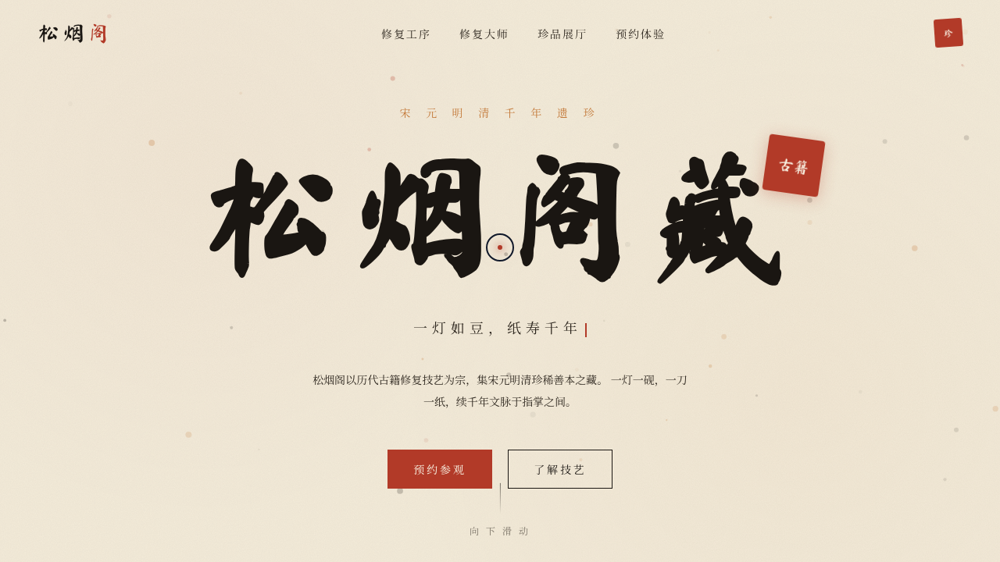

# 松烟阁 · 古籍修复技艺展官网

> 日期：2026-08-18 · 方向：V1 网页设计 · 主题：古籍修复技艺展

以宣纸、松烟墨、朱砂印为美学基调的东方艺术展览官网。单页艺术品级完整网站：从书法标题逐字揭示、朱砂印章盖下，到六道修复工序 3D 倾斜卡片与珍品光泽扫过，围绕「古籍修复」主题组织真实内容与动效。

## 动效亮点

- 自定义光标（白环 + 朱砂内点 + 多层发光，开页即居中，悬停三态、点击涟漪）
- 45 颗墨粒布朗运动粒子系统（独立相位与呼吸周期）
- 「松烟阁藏」逐字揭示 + 朱砂印弹簧盖章动效
- 打字机副标题、数字计数、滚动错落渐入、背景汉字反向视差
- 卡片 RAF 阻尼 3D 倾斜、磁性 CTA 按钮（反平方引力）、珍品卡光泽扫过

## 文件说明

| 文件 | 说明 |
|------|------|
| `index.html` | 完整单文件应用（JSX/CSS 全内联） |
| `设计规范.md` | 色彩/字体/动效/结构规范 |
| `preview.png` / `thumbnail.png` | 页面截图 |
| `README.md` | 本文件 |

## 在线预览

https://dcniaqwtmoca.feishu.cn/page/U3BomG0XFdxOn2a4RC4cC3VPn0f

## 技术栈

妙搭 HTML 应用 · React（Babel 内联 JSX）· 纯 CSS 动效 · IntersectionObserver / RAF
