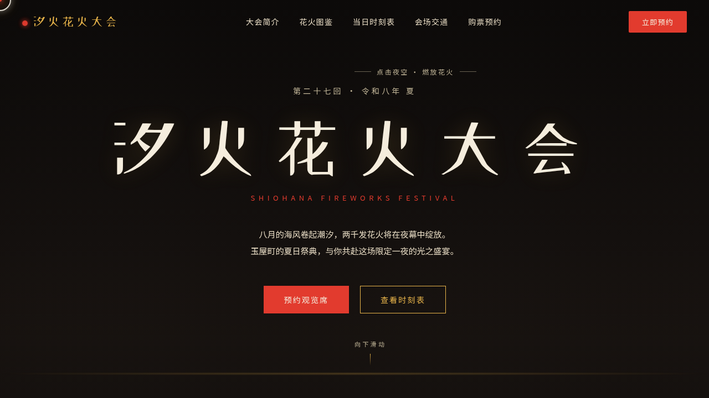

# 汐火花火大会 · V1 网页设计

- 日期：2026-08-18
- 方向：V1 网页设计
- 主题：汐火花火大会 —— 夏夜海边花火节官方网站
- 配色：炭黑夜空 + 朱红 + 鎏金 + 暖米白

## 简介

一件完整的艺术品级单页官网，围绕夏夜海边花火大会组织真实内容：Hero 区点击夜空即可发射花火粒子（上升-绽开-缓落物理），花火图鉴展示「八重芯锦菊」「银冠瀑布」等拟真花火品种，当日时刻表、会场地图、观览席购票一应俱全。

## 截图展示

## 动效亮点

- 点击发射花火粒子（重力 + 阻尼 + 余烬闪烁，三种绽放模式）
- 自定义三环光标（弹簧跟随 + 金色光晕，悬停变色点击涟漪）
- 花火图鉴 3D 透视倾斜卡片 + 每卡独立迷你花火 canvas
- 滚动渐入 / 数字计数 / 按钮光泽扫过 / 星空呼吸 / 海浪微光 等 14 个组件级特效

## 文件说明

| 文件 | 说明 |
|---|---|
| index.html | 完整可运行源码（内联 CSS/JS） |
| preview.png | 页面截图 |
| 设计规范.md | 色彩 / 字体 / 组件 / 动效 / 页面结构规范 |

## 在线预览

https://dcniaqwtmoca.feishu.cn/page/M5t4mVPCxdrwRDaUMnZcg5zwnpg

## 技术栈

纯 HTML + CSS + Canvas + vanilla JS，无框架依赖，所有代码内联于 index.html。
