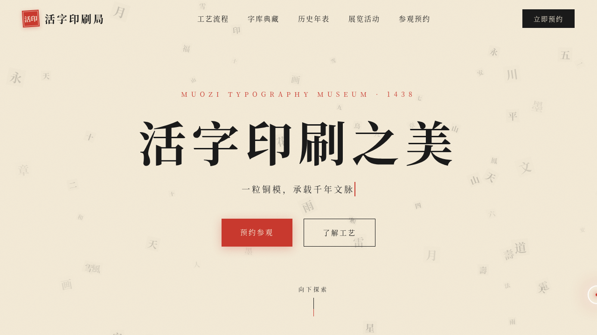

# 活字印刷局 · 博物馆官网

> 日期：2026-08-18 · 方向：V1 网页设计 · 主题：活字印刷博物馆官网

## 简介

一座活字印刷博物馆的官方网站。围绕活字铸造、拣字排版、印刷工艺、字库典藏组织真实内容，配以活字粒子背景、铅字压印标题与字模翻转交互，传递"宣纸为底、墨黑为骨、朱砂为印、黄铜为饰"的东方匠人美学。

## 配色

墨黑 `#1a1a1a` · 宣纸米 `#f5ecd9` · 朱砂红 `#c8392e` · 黄铜 `#b8923a`

## 动效亮点

- 活字粒子 Canvas 上浮 + 鼠标斥力
- 铅字逐字坠落压印标题
- 字模 3D 翻转入场
- 黄铜光泽斜扫按钮
- 打字机 / 数字计数 / 墨迹晕染

## 文件说明

| 文件 | 说明 |
|---|---|
| index.html | 完整可运行源码（单文件，纯 vanilla） |
| preview.png | 页面预览截图 |
| 设计规范.md | 色彩 / 字体 / 组件 / 动效规范 |

## 在线预览

https://dcniaqwtmoca.feishu.cn/page/Ad7qmgeYkdkTOHamc0dcVcaQnhb

## 技术栈

纯 HTML / CSS / JavaScript 单文件，无外部依赖，无框架。
