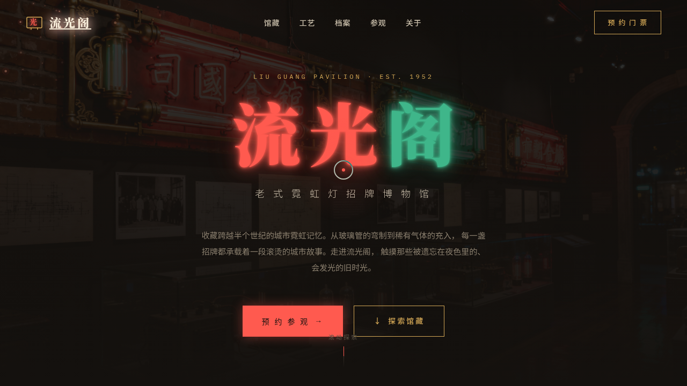

# 流光阁 · 老式霓虹灯招牌博物馆（V1 网页设计）

- **日期**：2026-08-18
- **方向**：V1 网页设计 —— 真实可交互的完整网站
- **主题**：流光阁 · 老式霓虹灯招牌博物馆——聚焦上世纪城市霓虹招牌的工艺与文化遗产

## 简介

一座线上霓虹灯招牌博物馆：炭黑展厅里，珊瑚红与翡翠绿的霓虹管逐帧点亮。从馆藏精品、霓虹的嗡鸣（频谱振动）、工艺时间线到参观预约，构成一个完整单页网站体验。

## 截图

## 动效亮点

- 霓虹闪烁入场 + 呼吸脉冲：Hero 大标题逐帧点亮后持续呼吸发光
- 频谱条振动：「霓虹的嗡鸣」展区，多频率正弦叠加的声波柱
- 3D 卡片倾斜 + 图片视差：馆藏卡随鼠标透视倾斜
- 自定义光标：白环 + 红点 + 发光晕，悬停变色放大、点击涟漪
- 尘埃粒子漂浮、数字计数、按钮光泽扫过、模态框弹性缩放等共 16 项

## 妙搭在线预览

https://dcniaqwtmoca.feishu.cn/page/A1pGm6KondI7QQaFDX8cJMkvnJg

## 文件说明

| 文件 | 说明 |
|---|---|
| `index.html` | 完整单文件网站源码（纯 HTML/CSS/JS，可直接浏览器打开预览） |
| `设计规范.md` | 色彩系统 / 字体 / 组件 / 动效 / 页面结构 |
| `thumbnail.png` | 页面截图（1280×720） |
| `README.md` | 本说明 |

## 技术栈

纯 HTML + CSS + JavaScript 单文件，无外部框架依赖；Noto Serif SC / Noto Sans SC / IBM Plex Mono 字体；IntersectionObserver 滚动入场；RAF 动画随页面可见性自动暂停；支持 prefers-reduced-motion 降级。
