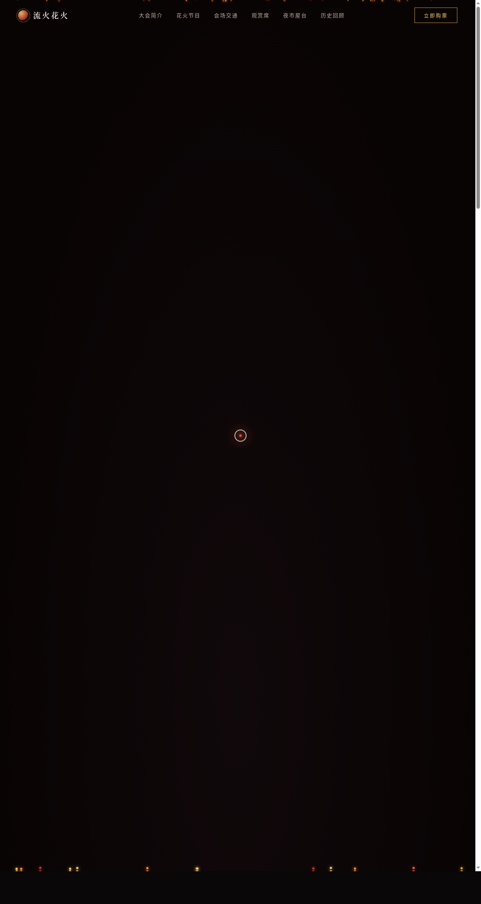

# 流火花火大会 · 活动官网

> 日期：2026-08-18 · 方向：V1 网页设计 · 主题：夏日河畔花火大会活动官网

## 简介

一场夏日河畔花火大会的完整活动官网，围绕花火节目单、会场交通、观赏席票务、夜市屋台、历史回顾等内容组织真实可信的活动信息。深夜黑底 + 朱红鎏金暖白的配色呼应花火升空爆裂的暖色语义，纯 vanilla 单文件实现，零外部依赖。

## 截图

## 动效亮点

- Canvas 实时花火粒子系统（重力 + 空气阻力物理积分器）+ 余烬飘浮
- 自定义光标（白环 + 朱红内点 + 多层发光 + 悬停三态 + 点击涟漪）
- 3D 卡片倾斜（damping 插值）、磁性按钮、滚动渐入、Hero 视差、灯笼 sin 摇摆、打字机、数字计数、按钮光泽扫过、地图标记脉冲、品牌徽标呼吸（共 15+）

## 妙搭在线预览

https://dcniaqwtmoca.feishu.cn/page/Eiy5mfrh6d0UdUaLbptcWUJnngg

## 文件说明

| 文件 | 说明 |
|---|---|
| index.html | 完整可运行源码（内联 CSS/JS，纯 vanilla） |
| preview.png | 页面截图（1280×2400） |
| thumbnail.png | 平台缩略图 |
| 设计规范.md | 色彩/字体/动效/页面结构规范 |

## 技术栈

HTML5 + Canvas 2D + 原生 JS（IntersectionObserver / requestAnimationFrame）。
