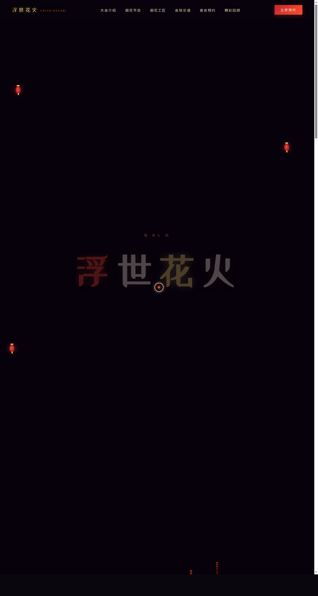

# 浮世花火 · 夏夜烟花大会

- **日期**：2026-08-18
- **方向**：V1 网页设计
- **主题**：夏夜烟花大会活动官网（浮世绘风祭典氛围）
- **配色**：墨黑夜空 + 朱红 + 鎏金 + 烟白（严禁蓝紫渐变）

## 简介

一件完整的、真实可交互的烟花大会官网。围绕「浮世花火」主题组织六大区块：大会缘起（余烬画布 + 数字统计）、烟花节目单（三夜 21 场次切换）、六位人间国宝烟花工匠、会场地图与交通、票务预约（三档席位）、历年回顾画廊（筛选 + Lightbox）。点击页面任意位置可发射烟花（交互彩蛋）。

## 截图

## 动效亮点

- 全屏 Canvas 烟花系统（火箭升空 + 重力 + 圆形/垂柳/双环三种绽放，粒子阻尼衰减）
- 自定义光标：白环 + 朱红内点 + 多层发光，开页居中、悬停放大、点击涟漪
- 余烬飘落粒子、灯笼视差、工匠卡片 3D 倾斜、数字计数、滚动渐入、光泽扫过、头像脉冲、地图脉冲点、Lightbox 过渡、标题逐字异色入场
- 共 15 个组件级特效，全部基于物理模型或烟花语义

## 在线预览

[浮世花火 · 妙搭在线预览](https://dcniaqwtmoca.feishu.cn/page/Wm8OmrJuVd0ZpJaUyxqcrTwinZe)

## 文件说明

| 文件 | 说明 |
|------|------|
| index.html | 完整源码（HTML + 内联 CSS + 内联 JS），单文件可直接运行 |
| preview.png | 预览截图（1280×2400） |
| 设计规范.md | 色彩系统、字体、组件、动效、页面结构 |

## 技术栈

纯 HTML/CSS/JS 单文件，Canvas 2D 烟花粒子系统，IntersectionObserver，requestAnimationFrame；无框架依赖、无外部 JSX 引用。
