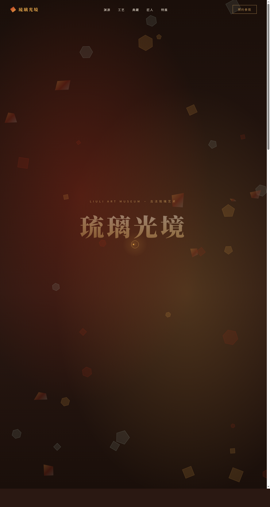

# 琉璃光境 · 古法琉璃艺术博物馆官网

> 日期：2026-08-18 · 方向：V1 网页设计 · 主题：古法琉璃艺术博物馆

## 简介

「琉璃光境」是一座以东方古法琉璃为主题的艺术博物馆官网。页面以墨褐暗调为底，朱砂红与琥珀金交织，营造火与砂、光与色的厚重美学。火中取色，光里成形——从脱蜡铸造工艺到历代珍品典藏，从匠人传承到当期特展，一件完整的、可交互的长滚动艺术品级网站。

## 截图预览

## 动效亮点

- Canvas 琉璃粒子背景，鼠标排斥产生流光扰动
- 标题逐字金光泽变，Logo 旋转呼吸
- 琉璃瓶 3D 倾斜 + 气泡上浮交互
- 匠人画像光晕跟随鼠标
- 时间轴进度填充 + 展览卡光泽扫过
- 自定义光标三环跟随，悬停变形、点击涟漪
- 共 16 个组件级特效，基于 RAF 积分器与弹簧阻尼模型

## 配色体系

| 角色 | 色值 |
|------|------|
| 主色 · 朱砂红 | `#B9301A` |
| 辅助 · 琥珀金 | `#E8A94B` |
| 点缀 · 冰青 | `#E8F4F0` |
| 底色 · 墨褐 | `#2A1812` |
| 赤金 | `#C69A5B` |

## 文件说明

| 文件 | 说明 |
|------|------|
| `index.html` | 完整可运行源码（纯 vanilla 单文件，含内联 CSS/JS） |
| `设计规范.md` | 色彩 / 字体 / 组件 / 动效 / 页面结构规范 |
| `preview.png` | 页面截图 |
| `thumbnail.png` | 缩略图 |

## 妙搭在线预览

https://dcniaqwtmoca.feishu.cn/page/BOU4mqsjqdPfb9aKqUTcRIbJnjh

## 技术栈

纯 HTML / CSS / JavaScript（vanilla），无 React / Babel / 外部 CDN 依赖；Canvas 粒子系统 + IntersectionObserver 滚动渐入 + RAF 物理动画。
