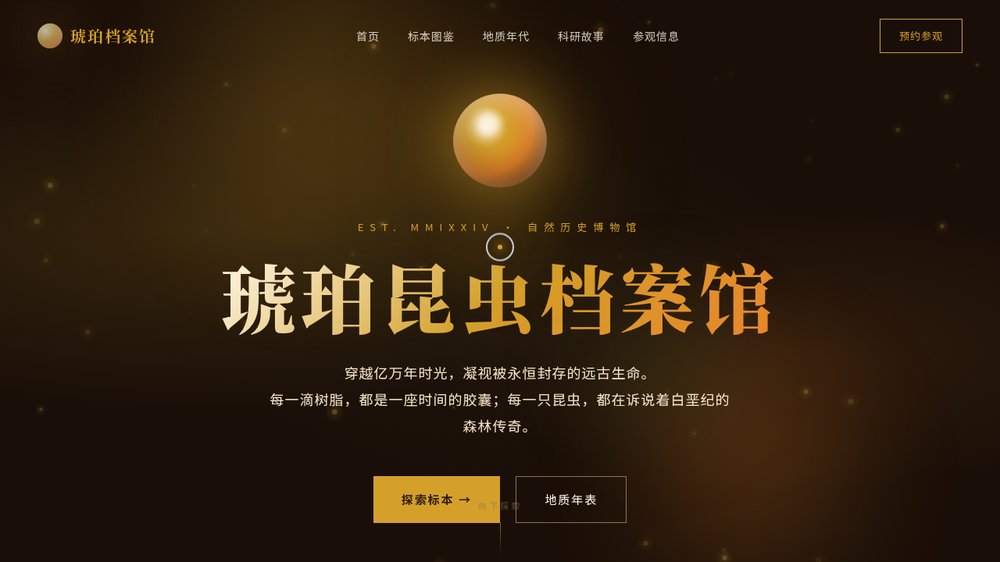

# 琥珀昆虫档案馆 · V1 网页设计

- 日期：2026-08-18
- 方向：V1 网页设计（真实可交互完整网站）
- 主题：琥珀昆虫档案馆——虚拟琥珀昆虫自然历史博物馆官网
- 配色：琥珀金 + 墨褐深底 + 松脂绿 + 羊皮纸米（禁止蓝紫渐变）

## 简介

一座夜间展厅质感的虚拟博物馆。墨褐深底托起琥珀金光泽，展示远古琥珀中封存的昆虫标本：8 件标本图鉴、地质年代滚动时间轴、馆藏数字计数、科研故事与参观信息。整页滚动式，每个区块都有入场动画与悬停反馈。

## 动效亮点

- 自定义光标（白环 + 琥珀金内点 + 多层发光，悬停变形，点击涟漪）
- 琥珀粒子上升闪烁系统（Canvas）
- Hero 琥珀石光晕脉冲 + 三颗流动光团鼠标视差
- 标本卡片悬停发光 + 光泽扫过 + 详情 Modal 缩放
- 时间轴滚动驱动左右交替渐入
- 数字 easeOutCubic 计数 + IntersectionObserver 分级渐入

## 文件说明

| 文件 | 说明 |
|---|---|
| index.html | 完整源码（HTML/CSS/JS 内联，纯 vanilla） |
| 设计规范.md | 色彩系统、字体、组件、动效、页面结构 |
| thumbnail.png | 页面截图 |

## 妙搭在线预览

https://dcniaqwtmoca.feishu.cn/page/WFCJmbPbodSQOJaGUTQcKPkin2d

## 技术栈

纯 HTML/CSS/JS（vanilla），无 React/无 Babel/无外部 CDN 依赖。
