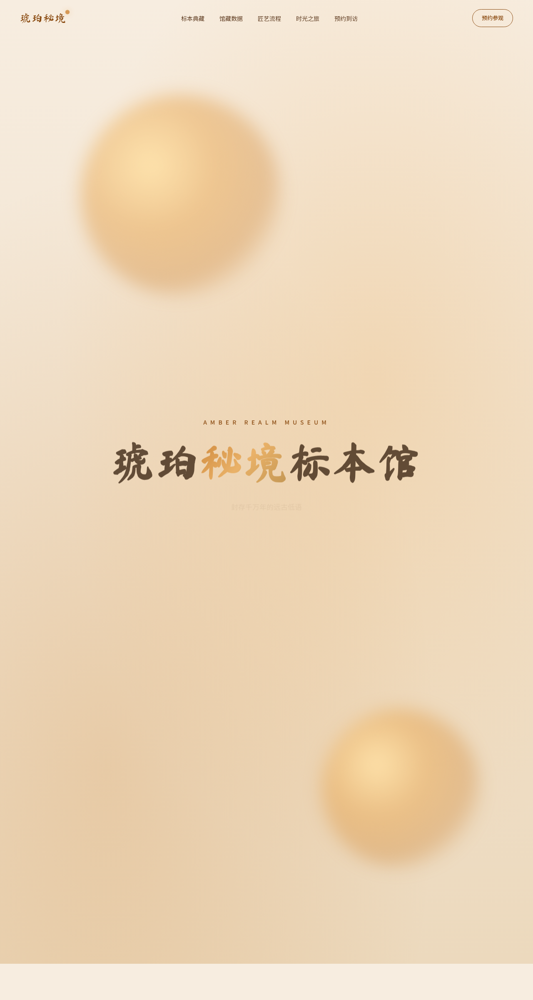

# 琥珀秘境标本馆

- 日期：2026-08-18
- 方向：V1 网页设计
- 主题：琥珀秘境标本馆——远古琥珀标本自然史博物馆官网
- 配色：暖琥珀色系（金琥珀 #C8761D / 墨棕 #3A2412 / 奶油纸 #F7EDE0），禁蓝紫渐变

## 简介

一家收藏远古琥珀标本的自然史博物馆官网。暖琥珀色 + 奶油纸底，衬线展示字标题，琥珀涟漪、漂浮粒子、3D 倾斜标本卡、打字机、数字计数等 12+ 组件级动效。导航收缩、分类筛选、时光之旅四 Tab、预约表单全部真实可交互。

## 截图

## 动效亮点

自定义光标（弹簧 Hooke 积分）、琥珀涟漪 canvas（半径平方缓动）、卡片 3D 倾斜（DOM 直写 RAF）、漂浮粒子、打字机、数字计数器、光泽扫过、脉冲发光、滚动渐入。

## 妙搭在线预览

https://dcniaqwtmoca.feishu.cn/page/Db79m4ejrdUnL1ahMnCcbZ3Enrc

## 文件说明

| 文件 | 说明 |
|---|---|
| index.html | 完整源码（HTML/CSS/JSX 全内联） |
| preview.png | 页面截图 |
| 设计规范.md | 色彩/字体/组件/动效规范 |

## 技术栈

单文件 HTML + 内联 CSS + Babel/React JSX（全部内联，无外部 src）。
