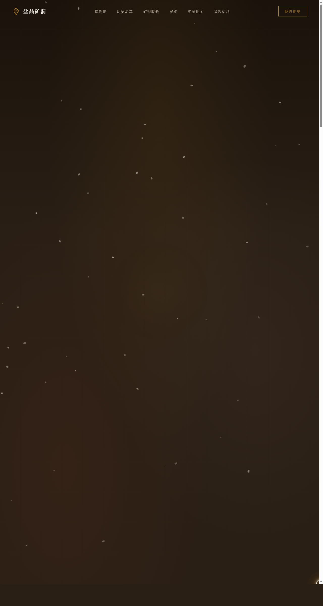

# 盐晶矿洞博物馆 · V1 网页设计

> 日期：2026-08-18 · 方向：V1 网页设计 · 主题：盐晶矿洞博物馆官网

## 概述

一个虚构的地下盐矿改造而成的地质博物馆官网。展示盐晶矿物标本、矿洞历史沿革、当前展览、参观信息与互动矿洞地图。围绕盐晶矿洞主题组织内容与视觉语言，呈现地下矿洞的温暖、粗粝、结晶质感。

## 配色

矿洞大地色系：矿物白 #F5F2ED / 琥珀蜜 #C8902E / 深锈红 #8B3A1F / 矿洞棕 #2A1F15 / 盐晶淡粉 #E8C5C0。禁止蓝紫渐变。

## 动效亮点

- 盐晶飘落粒子（三种晶形 Canvas 粒子系统）
- 晶体生长动画（Hero 区域晶体从地面向上生长）
- 矿灯光斑追踪（跟随鼠标的锥形光线）
- 3D 倾斜标本卡（鼠标跟随旋转）
- 数字计数动画（博物馆数据从 0 计数到目标值）
- 自定义光标（白色粗环 + 琥珀色内点 + 多层发光）

## 文件说明

| 文件 | 说明 |
|------|------|
| index.html | 完整单文件源码（HTML + CSS + JS 内联） |
| preview.png | 页面截图 1280×2400 |
| 设计规范.md | 色彩系统、字体、组件、动效规范 |

## 妙搭在线预览

https://dcniaqwtmoca.feishu.cn/page/IJjCmooS1dsr6qa6kwvc1G4znRd

## 技术栈

纯 vanilla HTML/CSS/JS 单文件实现，无 React / 无 Babel / 无外部 CDN 依赖。
