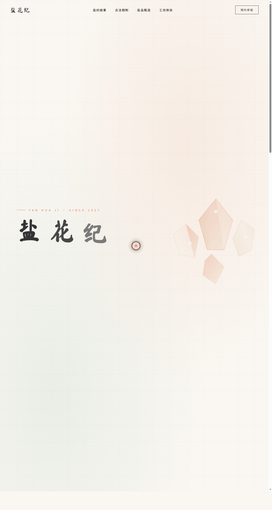

# 盐花纪 · 手工海盐工坊品牌官网

> 日期：2026-08-18 · 方向：V1 网页设计 · 主题：手工海盐工坊品牌官网

## 简介

「盐花纪」是一件艺术品级的手工海盐工坊品牌官网，围绕古法晒盐、盐花结晶、海洋风物组织真实可信内容。单页滚动叙事，从首屏盐晶粒子到末尾数据看板，串联"盐之诞生"的完整故事。配色以盐晶白 + 珊瑚橙 + 暖沙金为主，禁用蓝紫渐变，贴合"盐晶结晶 / 潮汐 / 日晒"主题语义。

## 截图

## 动效亮点

自定义光标（四层 lerp 跟随，开页居中显示）、盐晶粒子正弦潮汐漂移、产品卡片 3D 倾斜 + 光泽扫过、磁性按钮反平方引力吸附、多层潮汐波浪、工艺盐柱生长、数字 easeOutQuart 计数。共 14 项组件级动效，均基于物理模型或主题语义。

## 文件说明

| 文件 | 说明 |
|---|---|
| index.html | 完整可运行单页源码（含内联 CSS/JS，React + Babel CDN） |
| preview.png | 页面截图（1280×2400） |
| thumbnail.png | 妙搭平台缩略图 |
| 设计规范.md | 色彩系统、字体、组件、动效、页面结构 |
| README.md | 本说明文件 |

## 妙搭在线预览

https://dcniaqwtmoca.feishu.cn/page/VfHvm9d0Adje1HarpoqcR7Svnwc

## 技术栈

React 18 + Babel standalone（JSX 内联于 index.html）+ 原生 CSS 动画 + Canvas/SVG 粒子 + IntersectionObserver。
