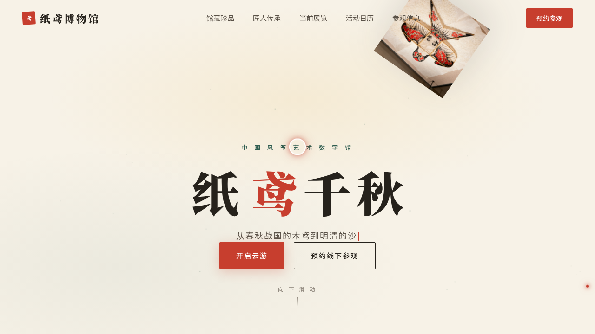

# 纸鸢博物馆 · 风筝艺术数字博物馆官网

> 日期：2026-08-18 · 方向：V1 网页设计 · 主题：中国风筝艺术数字博物馆官网

## 简介

「纸鸢博物馆」是一座以中国风筝艺术为主题的数字博物馆官网。页面以宣纸米白为底、朱红黛绿为主色，营造东方纸艺质感。围绕馆藏风筝（沙燕/龙头/蝶形/鹰形）、匠人传承、当前展览、活动日历与参观预约组织真实内容，配以风筝物理摆荡、风粒子、3D 倾斜卡片等动效。

## 截图

## 动效亮点

- 首屏沙燕风筝钟摆物理摆荡（钟摆方程 + 随机风力扰动，带动风筝线同步摆动）
- 25 颗风粒子横向飘动 + 垂直正弦摆动
- 馆藏卡片 3D 倾斜（mousemove 直接操作 transform + 阻尼跟随）
- 数字计数 easeOutExpo 缓动、打字机循环副标题
- 自定义光标：白环 + 朱红内点 + 多层发光，悬停三态切换 + 点击涟漪
- 匠人头像脉冲环、展览卡片左侧彩条滑入、CTA 光泽扫过

## 妙搭在线预览

https://dcniaqwtmoca.feishu.cn/page/AsAYmUMfGdvJbvaCC0Jcb4WWnbe

## 文件说明

| 文件 | 说明 |
|------|------|
| index.html | 完整可运行源码（React + Babel，JSX/CSS 内联单文件） |
| 设计规范.md | 色彩系统、字体、组件、动效、页面结构 |
| thumbnail.png | 页面截图 |

## 技术栈

React 18 + Babel Standalone（JSX 内联于 `<script type="text/babel">`），单文件 HTML，零外部图片引用。
