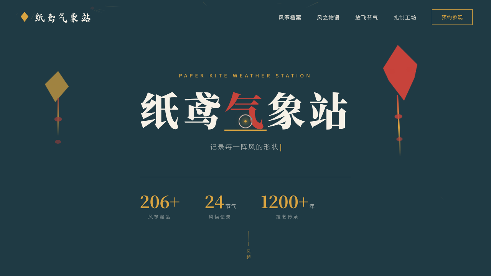

# 纸鸢气象站 · V1 网页设计

> 日期：2026-08-18 · 方向：V1 网页设计 · 主题：风筝文化与风之档案品牌官网

## 简介

「纸鸢气象站」是一座收藏"风"与风筝文化的品牌官网：以风筝档案、风之物语、放飞节气、扎制工坊为内容主线，呈现潍坊硬翅、北京沙燕、南通板鹞等真实流派与清明、立夏、秋分、小雪等节气风候。黛青纸白、茜红藤黄的传统配色，搭配风场粒子与纸鸢摇曳的物理动效。

## 动效亮点

- 全页风场粒子系统（2D 噪声流线 + 纸鸢颗粒）
- Hero 双鸢弹簧摇曳 + S 形飘带
- 6 张风筝卡 3D 倾斜（鼠标驱动 DOM transform）
- 自定义光标开页即居中显示，悬停变形、点击涟漪
- 滚动渐入、数字计数、打字机、风速指针波动

## 文件说明

| 文件 | 说明 |
|---|---|
| index.html | 完整可运行源码（HTML/CSS/JS 内联） |
| 设计规范.md | 色彩 / 字体 / 组件 / 动效 / 页面结构 |
| preview.png | 页面截图 |

## 在线预览

https://dcniaqwtmoca.feishu.cn/page/IJ2nmk44NdZ6JraO8ricoUXgnq8

## 技术栈

原生 HTML/CSS/JS（无框架），RAF 物理积分器，IntersectionObserver，prefers-reduced-motion 支持。
