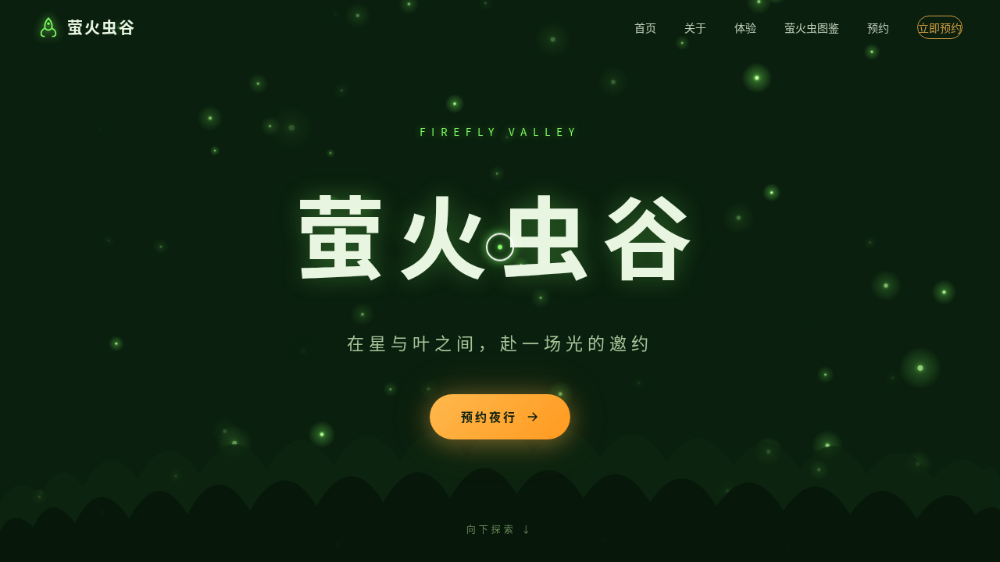

# 萤火虫谷 · 夜行体验官网

> 日期：2026-08-18 · 方向：V1 网页设计 · 主题：萤火虫保护基地夜行体验预约官网

## 简介

萤火虫谷是一个萤火虫保护基地的夜行体验预约官网。以深森林暗色调为底，生物荧光绿与暖琥珀金为主色，营造夜幕下萤火虫闪烁的沉浸氛围。包含完整的导航、Hero、关于、体验项目、萤火虫图鉴、预约表单和页脚七大区块。

## 截图

## 动效亮点

- 70 个粒子萤火虫光点随机飘动+呼吸闪烁，鼠标移动时附近萤火虫被吸引聚拢
- 自定义光标（白色粗环+荧光绿内点+多层发光），开页即显示在屏幕中央
- 体验卡片 3D 倾斜悬停 + 荧光绿发光边框
- 萤火虫图鉴卡片荧光脉冲呼吸（各卡片错位相位）
- 三层森林剪影视差滚动
- 数字计数动画、Hero 标题逐字淡入、按钮光泽扫过等共 13 项组件级特效

## 文件说明

| 文件 | 说明 |
|------|------|
| `index.html` | 完整源码（HTML+CSS+JS 单文件） |
| `设计规范.md` | 色彩系统、字体、组件、动效、页面结构规范 |
| `preview.png` | 页面截图 |
| `thumbnail.png` | 缩略图 |

## 妙搭在线预览

https://dcniaqwtmoca.feishu.cn/page/GAummQunCdCmZZaytrIccioCnnc

## 技术栈

纯 vanilla HTML/CSS/JS 单文件，无 React/Babel/CDN 依赖，Canvas 2D 渲染粒子系统，IntersectionObserver 滚动监听。
