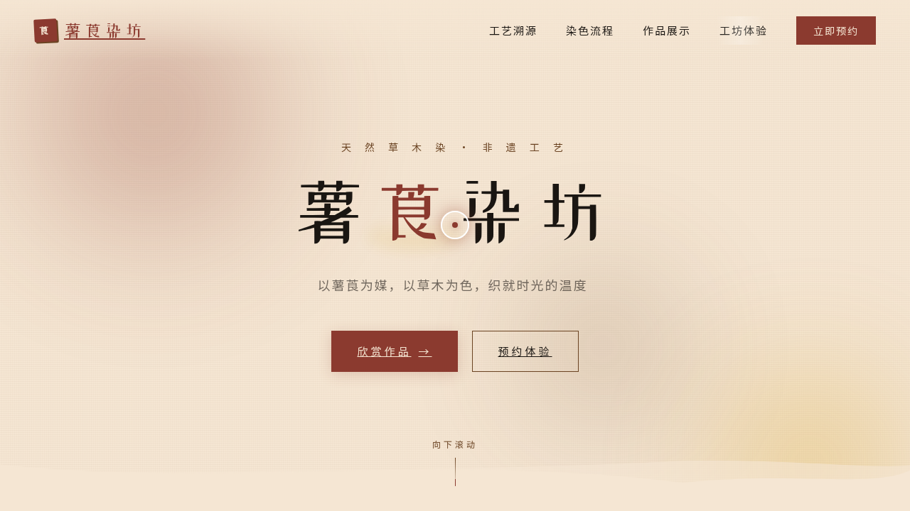

# 薯莨染坊 — V1 网页设计

**日期：** 2026-08-18
**方向：** V1 网页设计
**主题：** 薯莨染坊——天然草木染工坊品牌官网

## 简介

围绕传统薯莨染工艺打造的天然草木染工坊品牌官网。以温暖大地色调（薯莨红棕 + 栀子金黄 + 茶褐 + 生坯米白）呈现染坊的工艺溯源、染色流程、作品展示与工坊体验预约，整体视觉如染缸中浸出的层次。

## 截图

## 动效亮点

- 自定义光标（白环 + 红心 + 多层发光，悬停变金放大，点击涟漪）
- 染料晕染 blob 视差漂浮 + "莨"字血脉渗出填充动画
- 6 步工艺 3D 倾斜卡片 + 数字计数滚动
- 画廊光泽扫过 + Lightbox 弹窗
- 布料波浪 SVG 飘动 + 打字机副标题
- 共 12+ 组件级动效

## 文件说明

| 文件 | 说明 |
|------|------|
| index.html | 完整可运行源码（含内联 CSS/JS） |
| 设计规范.md | 色彩系统、字体、组件、动效、页面结构 |
| preview.png | 页面截图 |
| thumbnail.png | 平台缩略图 |

## 妙搭在线预览

https://dcniaqwtmoca.feishu.cn/page/EPEomXZfRdefQKadzkLcabUYndf

## 技术栈

纯 vanilla HTML/CSS/JS 单文件，无 React/Babel/CDN 依赖。requestAnimationFrame 动画随 visibilitychange 暂停，支持 prefers-reduced-motion。
