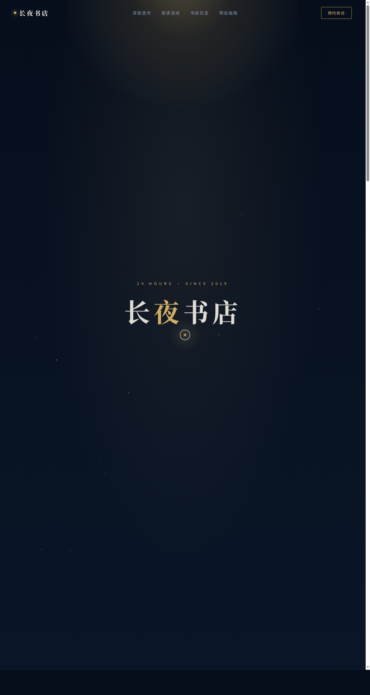

# 长夜书店 Midnight Bookstore

> 方向：V1 网页设计 · 日期：2026-08-18
> 主题：一家 24 小时不打烊的深夜独立书店官网

## 简介

「长夜书店」是一座深夜里的纸上灯塔。深墨蓝夜色铺底，蜜金台灯光晕作唯一暖光源，纸米白文字如灯下书页。页面围绕深夜选书、夜读活动、书店日志、到店指南展开，所有内容真实可信，可完整交互。

## 动效亮点

- 自定义三环光标（弹簧跟随，三态切换，开页即居中显示）
- 台灯呼吸光晕 + 悬浮尘埃粒子（RAF 积分 + 正弦摆动）
- 书籍 3D 翻转 + 光泽扫过，书架鼠标视差
- 打字机副标、数字计数、地图脉冲、事件金线展开
- 14 项组件级动效，周期各异，基于物理/语义模型

## 文件说明

| 文件 | 说明 |
|------|------|
| index.html | 完整可运行源码（JSX/CSS 全内联） |
| preview.png | 页面截图 |
| 设计规范.md | 色彩/字体/组件/动效/页面结构规范 |

## 在线预览

[长夜书店 · 妙搭在线预览](https://dcniaqwtmoca.feishu.cn/page/JFDImRgSRdStQEayER4c6fhanEf)

## 技术栈

React 18 + Babel Standalone（全内联），纯前端单页，无后端依赖。
