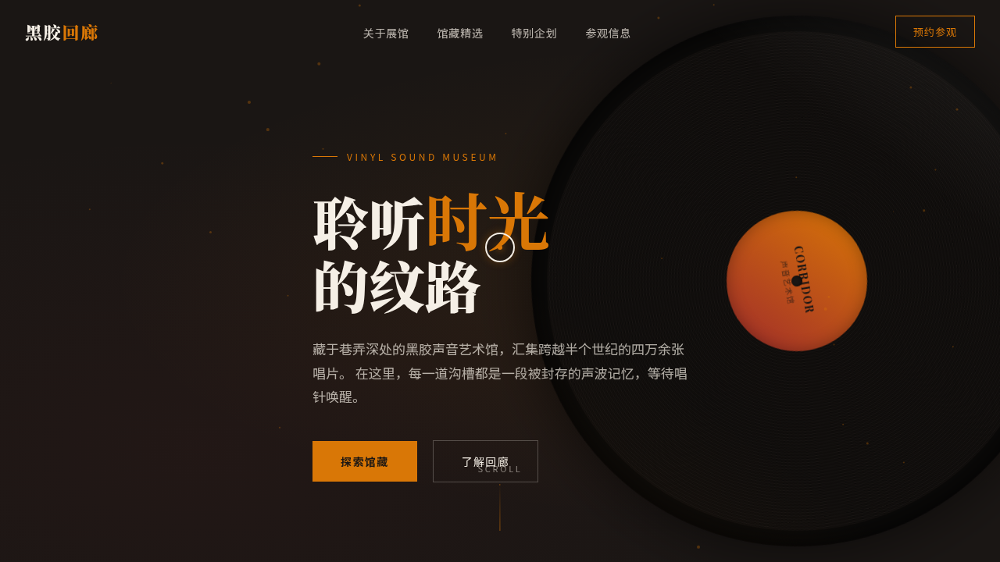

# 黑胶回廊 · 声音艺术馆

- 日期：2026-08-18
- 方向：V1 网页设计
- 主题：黑胶回廊 · 声音艺术馆（线上黑胶唱片博物馆）

## 简介

一个沉浸式的单页网站，模拟昏暗聆听室氛围的线上声音艺术馆。深炭黑底配琥珀金强调色，胡桃木与黄铜质感，以旋转黑胶、频谱振动与 3D 倾斜封面营造黑胶藏家的聆听仪式感。所有按钮、卡片、播放控件均可真实交互。

## 截图

## 动效亮点

自定义弹簧光标（开页居中）、Hero 大唱片 24 秒匀速旋转、馆藏封面 3D 倾斜 + 黑胶抽片、频谱柱独立弹簧振动、打字机标题、尘埃粒子漂浮、播放脉冲环、滚动渐入等共 14 个组件级特效。

## 文件说明

| 文件 | 说明 |
|---|---|
| index.html | 完整可运行源码（含内联 CSS / JSX / JS） |
| 设计规范.md | 色彩、字体、动效、组件规范 |
| preview.png | 页面预览截图 |

## 妙搭在线预览

https://dcniaqwtmoca.feishu.cn/page/RPHMmPxM2dzuFpaCzx5ccp2mnze

## 技术栈

React 18 + Babel Standalone（全部内联于单文件 index.html），纯前端无后端。
