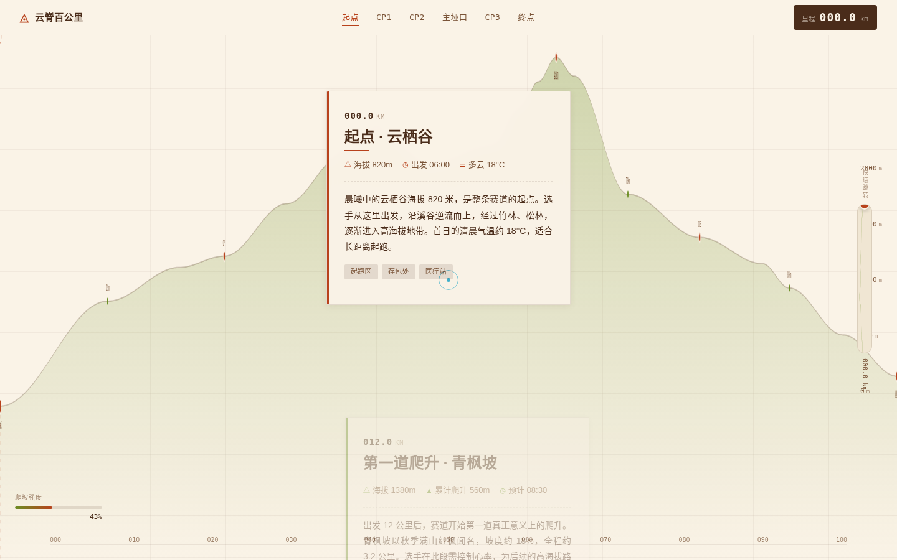

# 云脊百公里 · 越野跑赛事网站

> 日期：2026-08-19　|　类别：Web Mock　|　Art Orchestrator batch12

## 简介
一个越野跑赛事网站，整站就是一条 100km 赛道的连续海拔剖面。用户滚动页面即沿赛道从起点行进到终点，所有信息——爬升段、补给站、关门时间、天气、选手故事——都锚定在剖面的公里刻度上。海拔剖面既是空间模型，也是唯一导航主轴。

## 设计观点
不做一个"赛事 Landing Page"，而是让赛事路书本身成为网站：剖面是越野跑最真实的信息骨架，爬升/补给/关门全部天然挂在公里数上，结构由内容生长。

## 截图

## 妙搭预览
https://dcniaqwtmoca.feishu.cn/page/NvQsmL8xGds2cXaErOFcjkvLnE5

## 文件说明
- `index.html` — 页面结构
- `styles.css` — 样式（剖面、节点、光标）
- `script.js` — 滚动驱动剖面行进、游标、节点交互、RAF 生命周期
- `设计规范.md` — 色值/字体/动效系统
- `preview.png` — 1440×900 首屏截图

## 技术栈
纯 vanilla（HTML + CSS + JS，无框架/无构建）。字体经飞书字体 CDN 加载。自定义光标、prefers-reduced-motion 降级、RAF 随可见性暂停。

## 自查
删色后剖面骨架仍独立组织信息；主题换成马拉松后页面结构失效（路书逻辑为越野赛特有）；无 Hero+三卡片套路；首尾质量一致。
