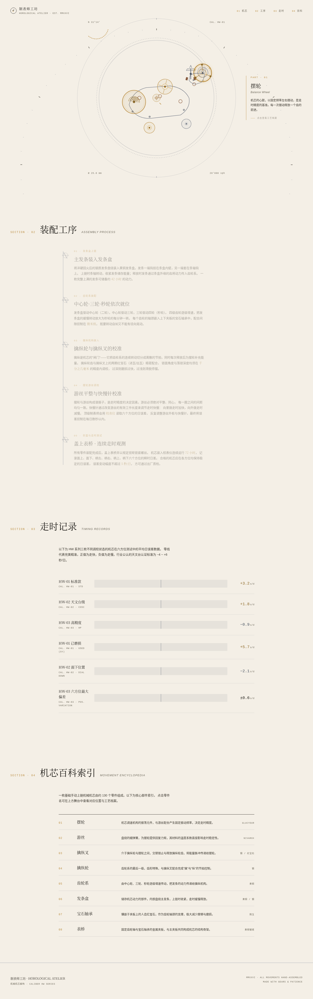

# 制表师工坊 · 机械腕表机芯解构

> 日期：2026-08-19　|　类别：Web Mock　|　Art Orchestrator batch14

## 简介
一座制表师工坊展柜式的网站：中央固定舞台陈列一枚可拆解的机械机芯，光标悬停高亮零件并联动标注，点击零件"开盖拆解"进入其工艺档案；向下是装配工序时间轴、走时记录、机芯百科索引。整站像走进一间安静的制表工坊，逐个零件理解机械之美。

## 设计观点
不采用通用 Landing 的 Hero+三列卡片。以"工坊展柜"为空间模型——固定机芯舞台为视觉重心，零件-标注联动 + 开盖拆解是与题材强绑定的核心交互。配色取自黄铜机芯与钢制工具，无蓝紫渐变。

## 截图

## 妙搭预览
https://dcniaqwtmoca.feishu.cn/page/Q4Q6m3M8edkmSIadoTKcGF0MnGb

## 文件说明
- `index.html` — 单文件纯 vanilla 实现（HTML+CSS+JS，无外部依赖）
- `preview.png` — 1440px 全页截图
- `设计规范.md` — 色值/字体/动效/材质系统

## 技术栈
纯 HTML + CSS + Vanilla JS，手绘 SVG 机芯，requestAnimationFrame 驱动，prefers-reduced-motion 全降级。无 React/Babel/CDN/外部图片。

## 核心交互
- 悬停零件：联动高亮 + 右侧标注面板
- 点击零件：开盖拆解分层动画 + 工艺档案卡片
- 自定义放大镜光标
- 装配工序时间轴 / 走时记录数据带 / 机芯百科索引

## 自查
- [x] 删动画后设计仍成立（静态展柜+档案结构可读）
- [x] 灰度下信息层级成立（靠空间/字级/留白，非仅颜色）
- [x] 轮廓与近期 web（拍卖行/鼓声渡江/云脊越野）明显不同
- [x] Browser QA：无 console error，截图非空白（pixelStd 13.9）
- [x] 内容真实，题材不可无脑替换
