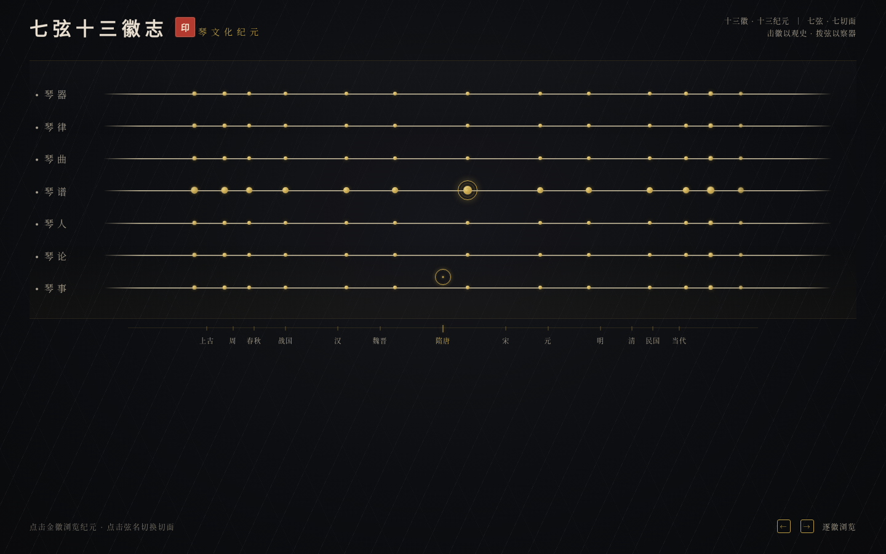

# 古琴·七弦十三徽志

> 一张横置的古琴弦板，十三徽串起三千年纪事，七根弦是七种听琴的方式。

## 简介

整页是一张横置的古琴弦板，7 根丝弦横贯画面，13 颗螺钿金徽按真实古琴分数位置（弦长的 1/8、1/6、1/5、1/4、1/3、2/5、1/2、3/5、2/3、3/4、4/5、5/6、7/8）精确嵌布于弦上。

这是一张「古琴文化纪元志」：**13 徽 = 古琴 13 个历史纪元**（横轴，从上古神农削桐到当代非遗），**7 弦 = 7 个文化切面**（纵轴：琴器/琴律/琴曲/琴谱/琴人/琴论/琴事），构成 [纪元 × 切面] 二维矩阵。

点击徽位 → 游徽磁吸落定 → 泛音涟漪荡开 → 该纪元内容显现；拨动某根弦 → 跳转至该切面的标志纪元。器的形制即史的脉络。

- **主题**：古琴文化纪元（中国文人音乐三千年纪事）
- **空间模型**：横置弦板 7 弦 × 13 徽二维矩阵
- **配色**：漆黑底 + 螺钿金徽 + 朱砂琴铭（漆器色系，非纸本水墨）
- **核心交互**：点击徽位磁吸游徽 + 泛音涟漪显现纪元 / 拨弦切面跳转 / 键盘逐徽浏览

## 妙搭预览

在线预览链接：https://dcniaqwtmoca.feishu.cn/page/YgvxmSIVGdB7b3ao1dGcq1apnYd

## 文件说明

| 文件 | 说明 |
|------|------|
| `index.html` | 单文件源码（HTML + CSS + JS，纯 vanilla，零外部依赖） |
| `设计规范.md` | 配色色值、字体、十三徽分数位置、七弦切面、动效系统、健壮性实现 |
| `preview.png` | 1440px 桌面端截图 |
| `README.md` | 本文件 |

## 技术栈

- 纯 vanilla 单文件（HTML + CSS + JS），无 React / Babel / CDN / 外部字体 / 外部图片
- 字体：系统衬线字体栈（Noto Serif SC / Songti SC / SimSun）
- 截图：Chromium headless 渲染
- 响应式断点：1440 / 1024 / 768 / 390

## 动效

13+ 组件级动效，符合古琴/漆器物理逻辑：游徽磁吸弹簧落定、泛音同心金环涟漪扩散、当前切面弦正弦微振、断纹底纹微光、纪元标题笔锋绘入、徽位金辉呼吸、切面标签朱砂高亮、年份数字翻入、callout 上浮、光标圆环拖尾、时间轴游标联动、弦板两端绘入入场。全部支持 `prefers-reduced-motion` 降级。

## 自查结论

- [x] 删动画后：弦板 + 13 徽 + 7 弦标签 + 当前纪元内容 仍成立
- [x] 灰度下：金徽 vs 漆黑底 vs 绢白文字 vs 朱砂标签 仍可辨
- [x] 轮廓：横置弦板 + 13 徽位 + 游徽，与近期作品（纵向叙事/卷轴/剖面/工作台/径向轮/网络图）无相似
- [x] 首屏即答：这是一张古琴弦板，徽位是琴史纪元
- [x] Browser QA：无 Console Error / 无 404 / 无横向溢出 / 截图像素 std=19.62 非空白
- [x] 交互可用：点击徽位显现纪元内容、键盘 ← → 逐徽浏览、拨弦切面跳转
- [x] 健壮性：RAF 随 visibilitychange 暂停、pagehide 卸载取消、支持 prefers-reduced-motion、触屏回落系统光标

等待协调者检查后提交 GitHub。
