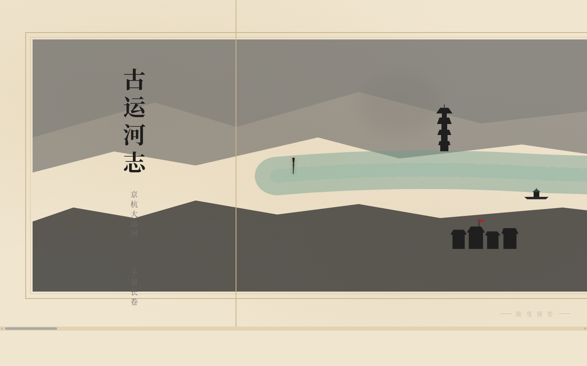

# 古运河志 · Grand Canal Chronicle

> 方向：V1 网页设计 · 日期：2026-08-19 · 主题：京杭大运河长卷航行体验

## 简介

「古运河志」是一幅可横向拖拽展开的数字长卷画。用户从北端北京通州出发，沿京杭大运河南下至杭州，途经 12 个真实运河站点——通州漕运码头、临清钞关、济宁河道总督署、淮安漕运总督、扬州盐运中心、苏州丝绸外运……每一段旅程都有密集的码头市井与疏朗的空旷水面交替，如同展开一卷宋元长卷。

整幅画卷宽 15600px，运河水线贯穿全卷。经过济宁、淮安两处船闸时，水线高度产生视觉落差，再现船闸升降原理。竖排题跋式注释标注每个站点的历史身份。

## 截图展示

## 妙搭预览链接

https://dcniaqwtmoca.feishu.cn/page/LWUlmpv0fdpRiXajIZZcTJDanDg

## 文件说明

| 文件 | 说明 |
|------|------|
| index.html | 完整源码（纯 vanilla 单文件，63KB） |
| preview.png | 浏览器截图（1440×900） |
| 设计规范.md | 设计系统文档（色值/字体/动效/空间模型） |

## 技术栈

- 纯 HTML + CSS + JavaScript，无 React / Babel / CDN 依赖
- requestAnimationFrame 物理动画循环
- 支持 prefers-reduced-motion
- 响应式适配 1440px / 768px

## 设计要点

- **空间模型**：横向长卷式，唯一导航方式是横向拖拽/滚轮
- **配色**：水墨三色体系（陈纸米色 + 墨黑 + 朱砂红 + 青绿水面），禁蓝紫渐变
- **字体**：楷体/宋体 serif 字族，竖排古典注释
- **动效**：16 项组件级特效，墨迹晕染入场、水面涟漪、船闸开合、飞鸟云飘
- **内容**：12 个真实运河站点，每个站点有真实历史内容
- **自定义光标**：毛笔尖形状，开页居中，层级最高
