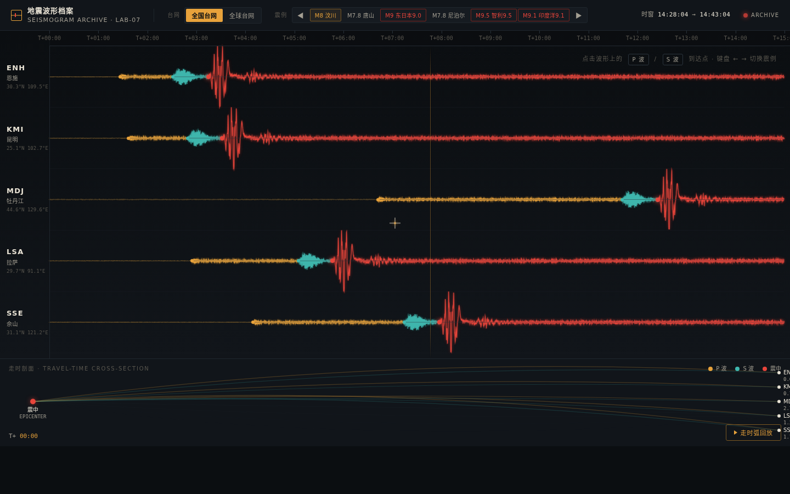

# 地震台网波形档案 · Seismogram Archive

> V1 网页设计 · 2026-08-19｜类别 Web Mock｜类型 数据 / 科学档案工具型

## 主题

多台网地震波形档案——把历史大地震的台站监测波形做成一条可翻阅的"记录仪胶卷"，点击 P 波 / S 波到达点揭示真实震情，走时弧回放让"波如何到达台站"可被亲手触发。

## 简介

整页是一台地震台网值班室里的记录仪：顶部仪器控制条（台网切换 / 震例选择 / 时间窗 / 操作提示），中段是 5 条台站波形轨纵向堆叠成的横向波形脊柱，底部是跨台站走时剖面与走时弧回放区。

波形按地震波阶段分色：琥珀=P 波（先到、小振幅）、青绿=S 波（后到、大振幅、破坏性强）、红=峰值震级。点击波形上的波至点，右侧浮出该次地震的真实档案（震级 / 深度 / 位置 / 发震时刻 / 影响），并触发走时弧回放——从震中向各台站按真实走时差依次点亮扩散。键盘 ← → 在 6 个震例间步进，ESC 关闭档案，空格触发回放。

**签名时刻**：点击东日本 9.0 那道刺破全轨的峰值，5 条台站轨按真实走时差依次重绘波形，走时弧从震中向各台站逐条点亮——亲手触发"波如何到达台站"。

## 截图

## 妙搭预览

https://dcniaqwtmoca.feishu.cn/page/RD1fmeVIDdYN8hajA7ccGEbFnpc

## 文件说明

- `index.html` — 单文件源码（HTML + CSS + JS，58.7K）
- `preview.png` — 桌面端截图（1440×900）
- `设计规范.md` — 色值 / 字体 / 动效系统 / 交互说明

## 技术栈

纯 vanilla 单文件 HTML，无 React / Babel / CDN / 外部图片。波形 Canvas 渲染，种子化伪随机可重现；RAF 随可见性暂停且卸载取消；支持 `prefers-reduced-motion`；十字准星自定义光标开页居中、高对比、层级最高。

## 设计要点

- **空间模型**：水平多台站波形迹线脊柱（5 轨纵向堆叠），非竖向 section / 卡片网格 / 固定单舞台 / 地图导航。
- **主交互**：click_wave_arrival（点击波至），非拖拽时间游标。
- **配色**：深近黑控制台 `#0B0E11` + 磷光琥珀 P 波 `#E8A23B` + 青绿 S 波 `#3FB8AF` + 警示红峰值 `#E8453B` + 米白文字 `#E8E2D4`，禁蓝紫、禁纸本水墨木色——与当日纸本水墨系列正交。
- **内容**：6 次真实历史大震（汶川 8.0 / 唐山 7.8 / 东日本 9.0 / 尼泊尔 7.8 / 智利 9.5 / 印度洋 9.1）+ 5 个真实台站（ENH/KMI/MDJ/LSA/SSE），参数全部真实，地球物理正确（近震中早到、P 先 S 后、幅度=震级）。
- **差异**：当日 20+ 版集中在传统中式工艺 + 拖拽交互 + 固定舞台 + 径向轮盘；本版转向现代科学数据工具，空间模型 `horizontal_multi_trace_spine` 全库零重复。

## 自查结论

- ✅ 水平多轨迹线为唯一脊柱，无 landing / 卡片网格 / 固定单舞台
- ✅ 点击 P/S 波至 → 真实震情档案 + 走时弧回放签名真实可用（drawTravelArc / replayLoop 接线确认）
- ✅ 6 次真实大震 + 5 真实台站，参数全部真实
- ✅ 配色严格按 Contract，禁蓝紫 / 禁纸本水墨木色
- ✅ 自定义光标开页居中、高对比、层级最高
- ✅ 12 项组件级动效符合地震波物理，禁 Ken Burns
- ✅ 纯 vanilla 单文件，RAF/可见性/reduced-motion 齐全；Browser QA 无 console error、截图非空白（std=20）
- ✅ Quality Gate = PASS（Contract Fidelity FULL / CRITICAL 0 / novelty PASS / technical PASS）

⏳ 等待协调者检查后提交 GitHub（本任务未执行 git add/commit/push）。
