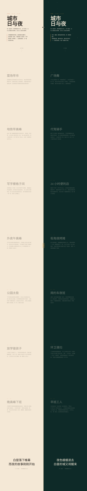

# 城市日与夜 · 双轨平行阅读

> 同一座城市，两种醒着的方式。向下滚动，左栏从清晨走向傍晚，右栏从入夜走向黎明。街灯一盏接一盏亮起来的时候，另一座就睡着了。

## 简介

这是一个 **Editorial 双轨对照阅读** 网页：整站以中线为界分为左右两栏，左栏是白昼（05:30–18:00），右栏是深夜（18:00–05:00），两栏共享同一根垂直滚动轴、内容对位行进。中间一道**可拖拽的昏分线**把世界劈成日与夜；滚动到"黄昏"章节时，两栏底色交叉淡入，夜侧街灯逐盏点亮。

7 对真实对位场景——菜场早市 / 街角烧烤摊、地铁早高峰 / 代驾骑手、写字楼格子间 / 24h 便利店……用气味、声音、光线和人物动作写出同一座城 24 小时的两种运转状态。

这不是 Landing Page，不是卡片网格，不是工具平台。它是一份可被滚动、可被拖拽的双轨城市速写。

## 妙搭预览

[城市日与夜 · 在线预览](https://dcniaqwtmoca.feishu.cn/page/L77kmPaq2ddu52axDsTcFPdXn4d)

## 截图

## 设计要点

- **空间模型**：`split_screen_sync_dual_track`（分屏同步双轨，库内首次）——左右栏并列、共享滚动轴、内容对位。
- **核心交互**：同步双轨滚动 + 可拖拽昏分线（改变两侧占比，含阻尼回弹）+ 黄昏街灯逐盏点亮签名动效。
- **配色**：暖象牙 `#F4E8D6` / 赤陶 `#C75B3C` / 柔琥珀 `#E8A33D`（白昼）vs 深青绿 `#0E2A28` / 暖象牙 `#EDE4D3` / 钠光琥珀 `#E8A33D`（深夜）。禁蓝紫渐变；钠光琥珀为横跨昼夜的唯一桥接色。
- **自定义光标**：日月光标——细水平线左端实心日、右端空心月，`mix-blend-mode: difference` 保证两侧可见，触屏/reduced-motion 降级为系统光标。
- **动效**：14 项组件级特效（底色随滚动偏移、星点闪烁、街灯逐亮、拖拽阻尼、天际线生长、黄昏交叉淡入、光标跟随、时间戳计数、hover 微浮起、双进度条、吸附回弹、分屏展开入场等）。

## 文件说明

| 文件 | 说明 |
|---|---|
| `index.html` | 完整源码（纯 vanilla 单文件，内联 CSS+JS，57.6KB） |
| `preview.png` | 1440×900 全页截图 |
| `thumbnail.png` | 缩略图 |
| `设计规范.md` | 完整设计规范（色值/字体/动效/交互/信息结构） |

## 技术栈

- 纯 vanilla HTML + CSS + JS，**零外部依赖**（无 React/Babel/CDN/外部 JS/外部字体）。
- 字体使用系统字体栈（Georgia / PingFang SC / SF Mono 等）。
- 所有路径相对路径。
- 响应式：390 / 768 / 1024 / 1440 均不崩；移动端（≤768px）改上下叠放、昏分线转水平可拖。
- 支持 `prefers-reduced-motion`；RAF/定时器随 `document.hidden` 暂停、卸载取消。

## Browser QA 结论

- 1440px：0 console 错误、0 失败请求、昏分线拖拽 ✓、滚动 ✓、横向溢出 1px（亚像素，MINOR）。
- 390px：0 console 错误、0 溢出、滚动 ✓。
- 截图非空白（全页 564KB）。
- Contract Fidelity = FULL；Quality Gate = PASS。

## 待办

本版已完成设计与质检，**等待协调者检查后提交 GitHub**。禁止自行 git add/commit/push。
