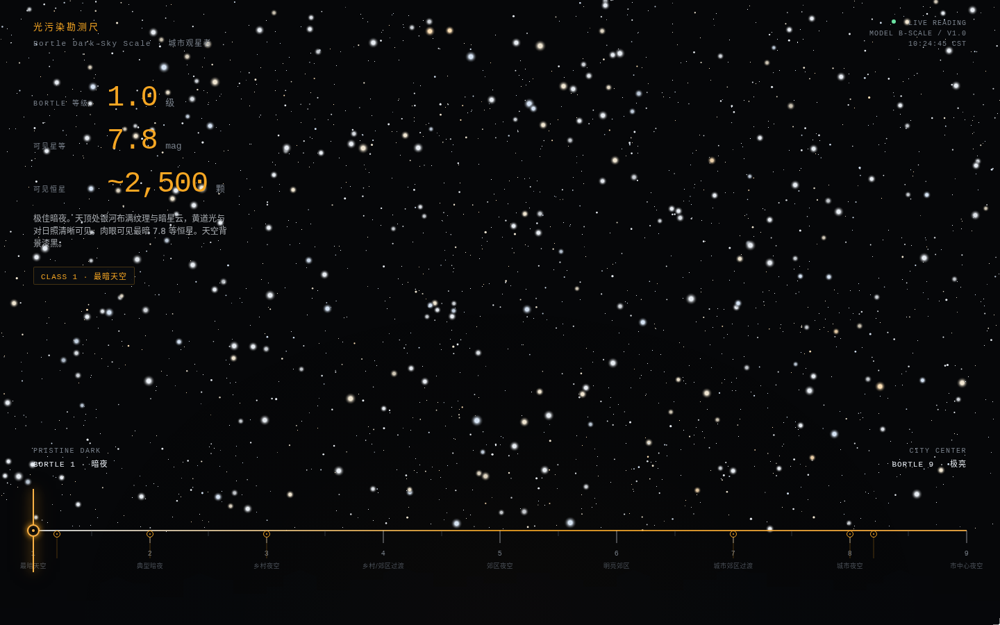

# 夜空光污染勘测尺

> 类别：Web Mock｜日期：2026-08-19｜妙搭预览：https://dcniaqwtmoca.feishu.cn/page/GiXAmwwkldHCAfaWsqscSZbOnye

## 主题与简介

**城市观星者光污染勘测尺**——一个数据/工具型网站。把 Bortle 光污染等级做成一条横向可拖动的连续光尺作为页面脊柱，拖动它，头顶星空在满目繁星与都市光雾之间连续变化，让"光污染如何吞噬星空"成为可被亲手推动的过程。

视觉来源：天文星图 + 城市夜景钠灯 + 测光仪器。配色为深空黑底 + 钠灯琥珀光雾 + 星点银白（非蓝紫渐变）。

## 签名交互

把光尺从 1 级（pristine 暗夜，满目繁星）拖到 9 级（市中心，只剩 2-3 颗最亮星淹没在橙色光雾里）——亲手"熄灭"星空。星点按真实星等亮度逐颗被光雾吞掉。

- 拖动光尺游标 → 星空星点密度/亮度连续变化 + 光雾扩散
- 点击光尺上的城市标记 → 右侧半屏详情（Bortle 等级、天光亮度、光污染来源、观测提示）
- 键盘 ← → 调整 Bortle 值，Esc 关闭详情

## 真实数据

6 个城市标记：青海冷湖 1.2 级、阿里 2.0 级、安吉天荒坪 3.0 级、杭州 7.0 级、北京 8.0 级、上海 8.2 级，含天光亮度值与可见星等。

## 文件说明

- `index.html`——单文件源码（HTML + CSS + Canvas + JS）
- `设计规范.md`——色彩 / 字体 / 动效 / 空间模型规范
- `preview.png`——桌面 1440×900 截图
- `thumbnail.png`——妙搭缩略图

## 技术栈

纯 vanilla 单文件，零外部依赖（无 React / Babel / CDN）。Canvas 绘制 2200 颗按真实星等分布的恒星。自定义十字光标（difference 混合，开页居中高对比）。`prefers-reduced-motion` 全面兼容，`visibilitychange` 暂停 RAF，卸载清理定时器。

## 设计自查

- 删动画后：光尺 + 星空 + 城市数据 + 九级对照表仍成立 ✓
- 灰度下：层级靠空间/尺寸/对比成立 ✓
- 轮廓：横向光尺脊柱布局，与近期纵向叙事/卷轴作品明显不同 ✓
- 非通用 Landing Page、非卡片 Grid、非蓝紫渐变 ✓
