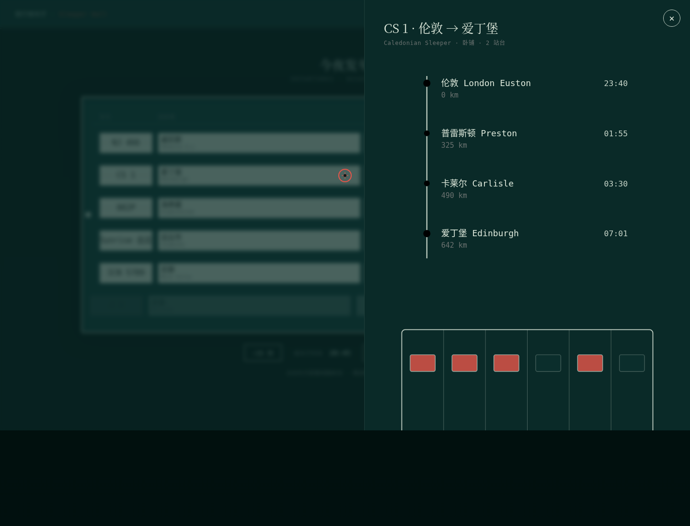

# 夜行候车厅 · Sleeper Hall

> V1 网页设计 · 2026-08-19 · Art 设计实验室

## 主题
夜行列车（sleeper train）。一座深夜长途夜车终点站的候车厅，抬头是那只活着的机械翻牌发车牌——翻牌板是整站唯一脊柱，牌面翻动 = 时间推进、车次终呼、车次离站。写给夜行列车衰落与复兴的一封情书。

## 简介
整站以一只机械翻牌发车牌为活体脊柱：点击「推进时间」按钮，多行牌面 3D 翻转级联更新，临近发车的车次翻成珊瑚红「终呼·即将发车」，到点后翻成「已发车」灰出向左滑走，下一趟顶上补位。点击任一车次，打开它的线路纵深——垂直站点阶梯逐站绘制点亮 + 卧铺车厢铺位剖面依占用点亮 + 里程时刻数据。附以夜行列车衰落与复兴的编辑正文、全球卧铺网络地理图。

6 趟真实夜车：ÖBB Nightjet（维也纳→威尼斯）、Caledonian Sleeper（伦敦→爱丁堡）、西伯利亚大铁路 002Р（莫斯科→海参崴，9288km）、日本 Sunrise 出云（东京→出云市，现存唯一定期卧铺）、法国 Intercités de Nuit（巴黎→尼斯）、中国 Z9（北京西→武昌）。线路、站点、里程、铺位类型、行程时长为可考证真实数据；时刻为示意性样表。

## 截图

完整页面（含编辑正文、线路纵深、全球网络图）见 `preview.png`。

## 妙搭预览
在线预览：https://dcniaqwtmoca.feishu.cn/page/AlGmmG6MzdisKZayGrUcX6KLnoE

## 文件说明
- `index.html` —— 纯 vanilla 单文件（内联 CSS + JS），整站实现。
- `设计规范.md` —— 配色 / 字体 / 信息结构 / 动效系统 / 健壮性（由源码真实提取）。
- `preview.png` —— 1440 宽完整页面截图。
- `preview_hero.png` —— 首屏翻牌发车牌截图。
- `README.md` —— 本文件。

## 技术栈
纯 vanilla 单文件 HTML，无任何外部依赖（无 CDN / 无外部字体 / 无 React / 无 Babel）。翻牌用 CSS 3D transform（perspective + rotateY/rotateX）；站点阶梯 / 铺位剖面 / 线路弧用内联 SVG + stroke-dashoffset；自定义光标用 pointermove + transform。支持 `prefers-reduced-motion` 全量降级；RAF / 定时器随页面可见性暂停且卸载取消。

## 自查结论
- Browser QA：1440 / 390 两档实测 0 Console Error、0 外部资源 404、无横向溢出、无重叠裁切；截图像素 std 23.03 > 5（非空白）。
- 健壮性：纯 vanilla 单文件，0 外部 URL 引用；`prefers-reduced-motion` 降级；`visibilitychange` 暂停；高频鼠标事件直接操作 DOM。
- 保真度：6 趟真实夜车 + NJ466 站点阶梯 + 卧铺剖面 + 全球网络弧线 + 自定义光标 + 翻牌级联签名均在源码中确认。
- 反模板：翻牌板脊柱（split_flap_departure_board）全库零重复；配色深汽油青主导 + 薄荷牌面 + 珊瑚红，禁蓝紫、禁纸本水墨、禁石墨灰主导。

---
**等待协调者检查后提交 GitHub。** 本任务不执行 git add/commit/push，由心跳协调者在质检通过后统一提交。
