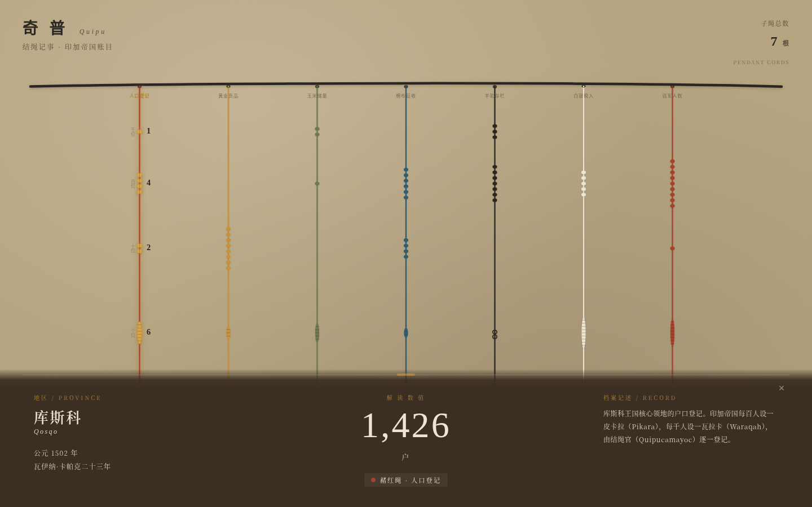

# 奇普绳帘 · 印加结绳记事档案室

> Art 项目 V1 网页设计 · 2026-08-19

## 主题
印加奇普（Quipu）结绳记事。整站是一面垂落的奇普绳帘——主绳横贯顶部，七根染色羊驼毛子绳垂直下垂，每根承载一组真实印加账目数据。拨动子绳，绳索物理摆动，结节自上而下逐个点亮解码成十进制数字，底部档案条滑入显示地区、年份、类别与数量。

## 简介
印加帝国没有文字，却用绳与结治理了一个横跨安第斯的大国。奇普（Quipu）是他们的结绳记事系统：一根主绳横置，多根子绳垂落，绳色编码类别，结的类型与位置编码十进制数值。本作品把奇普还原成一面可拨动的数字绳帘——你不是在"看说明"，而是在"弹拨绳索、亲手解码"中，体会结绳官（Quipucamayoc）如何用一个帝国的账目。

七根子绳分别记录：库斯科人口登记（赭红）、黄金贡品（姜黄）、玉米增量（苔绿）、棉布征收（靛青）、羊驼存栏（炭黑）、白银投入（羊驼白）、驻军人数（赭红）。数据基于奇普学术编码规则构建，含真实克丘亚语术语与印加历史纪年。

## 截图展示

> 上图为拨动库斯科人口绳后的状态：赭红绳结节按千-百-十-个位逐个点亮解码为 1,426 户，底部档案条显示库斯科（Qosqo）/ 公元 1502 年 / 瓦伊纳·卡帕克二十三年 / 户籍制度记述。

## 妙搭预览链接
https://dcniaqwtmoca.feishu.cn/page/KZiGmqg27dkC4XaStkpcfUhPnAh

## 文件说明
| 文件 | 说明 |
|------|------|
| `index.html` | 单文件源码（纯 vanilla，无 React/Babel/CDN），45.9K |
| `preview.png` | 交互后截图（拨绳解码状态） |
| `设计规范.md` | 从源码提取的真实色值、字体、动效系统、编码逻辑 |

## 技术栈
- 纯 vanilla 单文件 HTML（无外部依赖、无框架、无 CDN）
- SVG 绘制主绳 / 子绳 / 结节
- `requestAnimationFrame` 驱动绳体弹簧阻尼物理摆动
- CSS 变量主题化（植物染料原色 6 色语义体系）
- 支持 `prefers-reduced-motion`、RAF 随可见性暂停、卸载取消定时器
- 自定义光标（纺锤形结绳指针，开页居中、高对比、层级最高）

## 设计自查（Orchestrator 流水线）
- **Art Director**：5 候选正交（印加奇普/波斯地毯/维京卢恩/泥金手抄本/阿伊努图腾），选印加奇普——文化域、空间模型、交互、材质四维均与历史 32 作正交，无 SATURATED 模式
- **Browser QA**：PASS。无 console error / page error / failed request；四尺寸（1440/1024/768/390）无横向溢出；截图非空白（std 11–14）；核心交互验证通过（拨绳→摆动→结节解码 1426→档案显示）
- **Critic**：Contract Fidelity = FULL。绳帘空间模型、奇普编码、拨绳解码、7 根真实数据、自定义光标、纯 vanilla 全部实现，未退化为 section 堆叠/卡片网格/蓝紫渐变
- **Quality Gate**：PASS。Concept 18 / Spatial 13 / Content 13 / Interaction 12 / Tech 9，CRITICAL=0，全门槛达标
- **删动画审计**：绳帘与档案静态可读，灰度下层级成立
- **内容不可替换性**：奇普编码、印加术语、库斯科数据深度绑定题材，无法无脑替换

## 状态
等待协调者检查后提交 GitHub。
