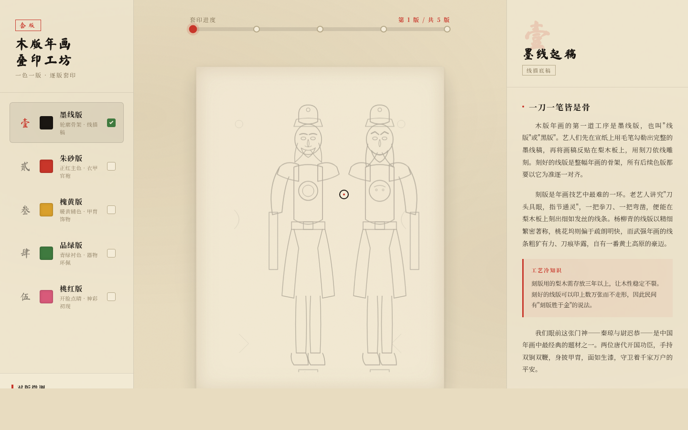

# 年画印坊 · 木版年画套版层叠站

**类别**：Web Mock　**日期**：2026-08-19

## 主题
中国传统木版年画（门神·秦琼尉迟恭）——以「一色一版、逐版套印」工艺为空间模型的可交互文化网站。用户像在作坊里看师傅把年画从墨线稿一版一版套色印出来。

## 简介
整站是一张正在被套印的年画：左侧版层索引（壹墨线/贰朱砂/叁槐黄/肆品绿/伍桃红）、中央宣纸画布（SVG 五层叠加门神）、右侧编辑式内容章节。拖动顶部「套印进度杆」或点击版层，画布从纯墨线稿逐版叠色到完整年画，每版叠加对应一章真实年画知识。末版「开脸」点睛为记忆点。

## 截图

## 妙搭预览链接
https://dcniaqwtmoca.feishu.cn/page/Dyxum3TcYdr1VEa1ff7cr8qxnld

## 文件说明
- `index.html`：单文件应用（内联 CSS/JS/SVG，jsx 内联于 `text/babel`，React+Babel via 飞书 CDN）
- `设计规范.md`：色值/字体/动效系统/空间模型
- `preview.png`：1440×900 桌面截图

## 技术栈
单文件 HTML + 内联 React 18（飞书 CDN）+ SVG 门神五层叠加。自定义光标开页居中高对比，`prefers-reduced-motion` 降级，页面隐藏暂停 RAF。Browser QA：1440/1024/390 三档渲染正常、无 console 严重错误。

## 设计要点
- 空间模型：叠版层叠式（layered_plate_stack），区别于卡片 Grid / Hero Landing。
- 五色为传统年画套色真实颜料体系（朱砂/槐黄/品绿/桃红 + 墨线），禁蓝紫渐变。
- 内容真实：刻线工艺、门神由来、四大产地（杨柳青/桃花坞/武强/朱仙镇）风格差异、灶王题材。
- 12+ 组件级动效贴合纸张/油墨/木印物理（对版微晃、油墨晕染、滚筒过墨、开眼点睛等）。
